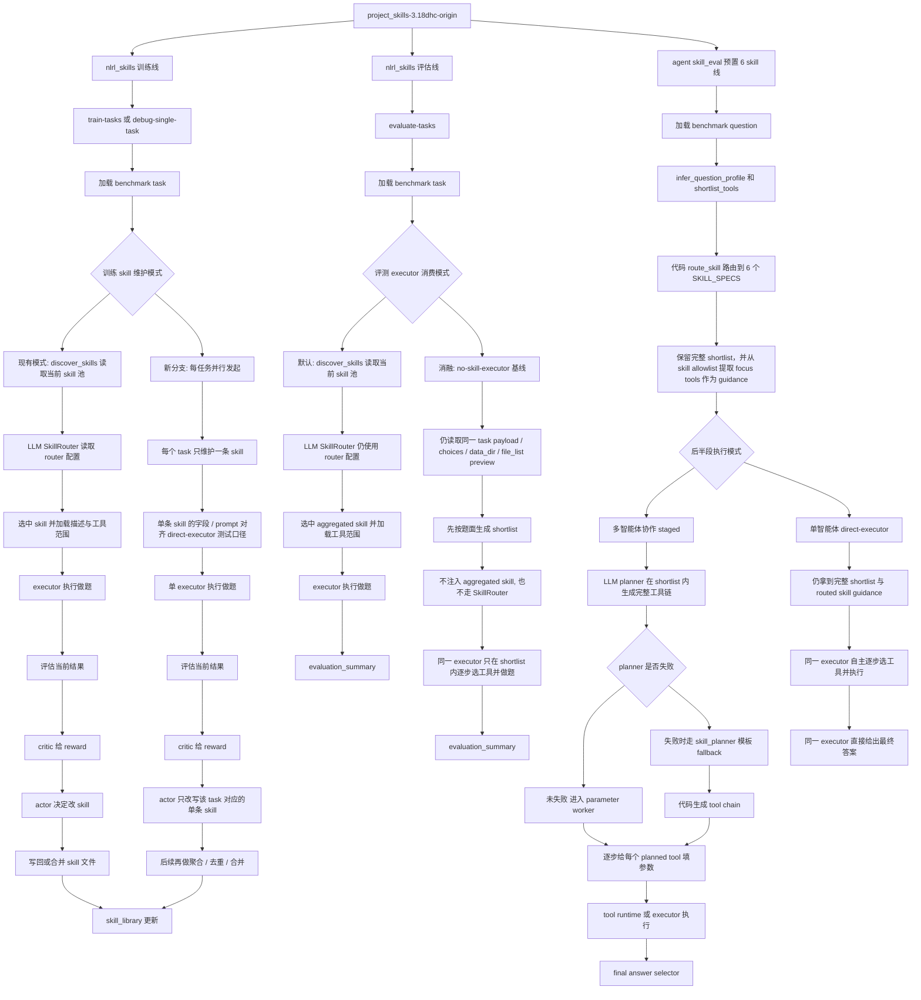
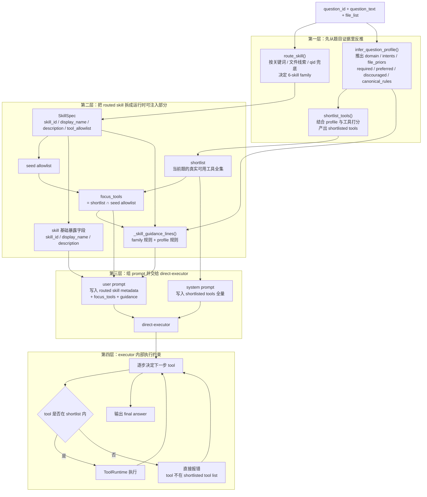
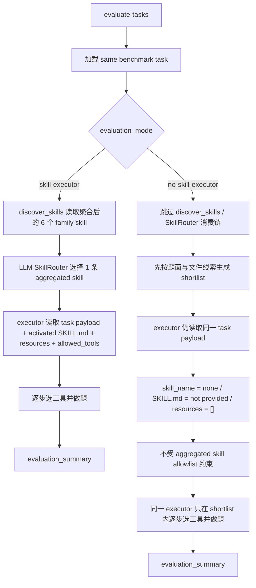

# origin / DHC / skill-pool 六优良梳理

时间：2026-04-01 18:34:42 +0800

这份文档专门把三个对象分开：

- `origin`：`/data/xsy/project_skills-3.18dhc-origin`
- `当前 DHC`：`/data/xsy/project_skills-3.18dhc`
- `当前 skill-pool`：`/data/xsy/skill-pool`

我下面的回答会尽量避免把三者混在一起。

---

## 1. origin 的“三模式”到底是什么

如果说的是 `origin` 项目根目录下 `nlrl_skills.cli` 的核心运行模式，那么它的三个核心运行模式是：

1. `debug-single-task`
2. `train-tasks`
3. `evaluate-tasks`

对应代码在：

- `/data/xsy/project_skills-3.18dhc-origin/nlrl_skills/cli.py`

具体区别：

### 1.1 `debug-single-task`

- 作用：对单个 task 跑一轮完整闭环，主要用于调试和观察。
- 本质：单题训练模式。
- 会跑完整的 `router -> executor/env -> critic -> actor` 闭环。
- 会改 skill 库，会写 experience buffer。
- 适合看单题为什么失败、actor 到底怎么改 skill。

### 1.2 `train-tasks`

- 作用：连续对多个 task 跑训练。
- 本质：批量训练模式。
- 也会经过 `router -> executor/env -> critic -> actor`。
- 会持续更新 `skill_library/` 和 `experience_buffer.jsonl`。
- 用来“长技能库”。

### 1.3 `evaluate-tasks`

- 作用：拿当前 skill 库做纯评估。
- 本质：固定 skill 库的测试模式。
- 不再跑 critic/actor 改 skill。
- 只看当前 skill 库在 benchmark 上的表现。

### 1.4 需要注意的一个混淆点

`origin` 里其实还有另一套“阶段划分”，那是 `agent/skill_eval` 里的三阶段：

1. planning only
2. parameter generation + tool execution
3. final answer selection

这个三阶段是在：

- `/data/xsy/project_skills-3.18dhc-origin/agent/skill_eval/README.md`
- `/data/xsy/project_skills-3.18dhc-origin/agent/skill_eval/staged_runner.py`

所以这里其实有两个“三分法”：

- `nlrl_skills` 的三个运行模式：`debug-single-task / train-tasks / evaluate-tasks`
- `agent/skill_eval` 的三个执行阶段：`plan / parameter+execute / answer`

---

## 2. origin 到底有没有“自己带着 6 个 skill”

### 2.1 要先分清楚：origin 里其实并存两套 skill 体系

#### A. `nlrl_skills` 这套外部 skill 库

这套是项目 README 里写的当前训练出来的 skill 包，存在：

- `/data/xsy/project_skills-3.18dhc-origin/skill_library/`

README 里列的是 4 个 skill：

- `ndvi-lst-tvdi-annual-trend`
- `ndvi-lst-tvdi-spike-count`
- `ndvi-lst-tvdi-single-date-threshold-exceedance`
- `ndvi-lst-tvdi-multidate-area-exceedance-count`

也就是说：

- `origin` 的外部 skill 库不是 6 个
- 而是当时训练出来的 4 个 TVDI 方向 skill

#### B. `agent/skill_eval` 这套代码级 6-skill family

这套在：

- `/data/xsy/project_skills-3.18dhc-origin/agent/skill_eval/skill_router.py`

这里内建了 6 个 `SkillSpec`：

- `earth-spectrum-thermal-retrieval`
- `earth-spectrum-drought-stress`
- `earth-product-timeseries`
- `earth-product-derived-index-change`
- `earth-product-raster-arithmetic`
- `earth-rgb-perception-change`

所以结论是：

- **origin 项目整体并不是“自己带着外部 6 个 skill 包”**
- **但是 `agent/skill_eval` 这条评估子系统内部，确实自带 6 个代码级 skill family**

这两套不是一回事。

### 2.2 origin 的评估测试里，skill 是怎么选的

如果说的是 `origin/agent/skill_eval` 这条评估链，那么：

- 选 skill 不是 LLM router
- 是 `route_skill()` 里的代码路由

代码在：

- `/data/xsy/project_skills-3.18dhc-origin/agent/skill_eval/skill_router.py`

它的逻辑是：

1. 先看题目关键词和文件特征做语义规则分流
2. 如果前面规则没命中，再用题号区间兜底

也就是说：

- **不是一题一题 hardcode**
- **但也不是让模型自由在 6 个 skill 里挑**
- **而是代码先决定 skill bucket**

而且这个路由已经精确到关键词层面，比如：

- `tvdi / drought / dryness / ATI` -> `earth-spectrum-drought-stress`
- `split-window / single-channel / band 31 / band 32 / lst` -> `earth-spectrum-thermal-retrieval`
- `png/jpg/building/airport/centroid/distance/destroyed` -> `earth-rgb-perception-change`

如果关键词没命中：

- `qid <= 100` -> thermal
- `qid <= 188` -> product-timeseries
- 否则 -> rgb

所以 skill 分配本身在这条链上是很强的代码先验。

### 2.3 origin 对工具链顺序是怎么做的

这个地方要特别区分：

#### 先说 `origin` 本身

`origin` 里虽然已经有：

- `/data/xsy/project_skills-3.18dhc-origin/agent/skill_eval/skill_planner.py`

这个模板文件，

**但在 origin 本身，它不是默认主路径。**

origin 的 README 和 `skill_llm_planner.py` 写得很清楚：

- 主路径：`skill-llm-json`
- 次路径：`skill-llm-tagged-fallback`
- 模板：`skill-template-fallback`

也就是：

- origin 默认仍然是 `LLM planner` 产出完整 `tool_sequence`
- `skill_planner.py` 只是 fallback
- 不是像当前 DHC 那样默认强制模板

所以对于 `origin` 来说：

- 有模板文件
- 但**不是默认直接用模板指定工具链**

#### 再说模板文件到底细到什么程度

`skill_planner.py` 不是按题号查 gold trajectory。

它的粒度是：

- 先按 `skill_id` 分到一个模板函数
- 再在模板函数里根据题面关键词、年份、compare/trend 等模式拼出顺序

例如 drought 模板里大致是：

- 先 `get_filelist`
- 如果题面是 ATI 就用 `ATI`，否则用 `compute_tvdi`
- 如果是 `trend/annual`，后面接重复的 `calculate_tif_average`，再 `calc_batch_image_mean`，再 `compute_linear_trend`
- 如果是 `threshold/severity`，后面接 `calculate_threshold_ratio`
- 如果是 `difference/compare`，就做两段再接 `difference`

所以它是：

- **family 级别的规则模板**
- **不是每题一份 gold 查表**

### 2.4 那么 origin 里的“6 个 skill”有没有用

对 **origin 本身** 来说，6 个 skill 不是没用。

因为 origin 默认路径里，6 个 skill 仍然负责：

1. 代码路由
2. 工具 allowlist / shortlist 范围
3. planner prompt 里的 skill-specific guidance
4. 后续参数和执行阶段的上下文约束

所以对 origin 来说更准确的说法是：

- 6 个 skill 不是外部文档 skill
- 而是 **代码里的 6 个运行时 skill family**

真正“让 skill 看起来像没用了”的，不是 origin，而是 **后来的当前 DHC 最新实验**：

- 它把 planner 又进一步强化成了 `skill-template-forced`
- 于是“工具顺序”这一层基本被代码模板接管了

所以请务必区分：

- **origin**：skill 仍然是主路径里的一部分，模板只是 fallback
- **当前 DHC 最新 run**：skill family 仍在，但工具顺序已经基本由代码模板主导

### 2.5 后面流程

你对后半段的理解基本是对的：

- planner 先出工具链
- parameter worker 逐步出参数
- executor 执行工具
- 最后 answer selector 选答案

这一点和你一贯认知是一致的。

---

## 3. 最近一次 DHC vs skill-pool 六优良实验，对比后到底说明什么

这里我对比的是最近一次正式 `6优良` run：

### 3.1 当前 DHC 最新 6优良 run

路径：

- `/data/xsy/project_skills-3.18dhc/runs/skill_eval_full/qwen3_8b_paid_skill_eval_parallel100_url34_sets/20260401_111039/`

总 summary：

- `count = 248`
- `avg_accuracy = 0.3508`
- `avg_efficiency = 0.5936`
- `avg_tool_any_order = 0.5927`
- `avg_tool_in_order = 0.4748`
- `avg_tool_exact_match = 0.4357`
- `avg_parameter_accuracy = 0.001`

并且我统计了全量 `execution_record.json`，结果是：

- `planning_source = skill-template-forced` 的题数：`248 / 248`

也就是说：

- 当前 DHC 这条 run **全部**都是强制模板规划
- 不是 origin 那种“LLM planner 为主，模板 fallback”

### 3.2 当前 skill-pool 最新 6优良 run

路径：

- `/data/xsy/skill-pool/project_skills/runs/evaluate_collaborator6_docref_allqwen/20260401_144845_collaborator6_docref_allqwen3888_global_eval_parallel100_url35_noproxy/`

总 summary：

- `task_count = 248`
- `success_count = 41`
- `Accuracy = 0.1653`
- `TAO = 0.5466`
- `TIO = 0.4564`
- `TEM = 0.3619`
- `Efficiency = 0.5414`
- `Parameters = 0.1758`

此外：

- `no_selected_skill = 4`
- `fallback_count = 3`

### 3.3 先给结论

你怀疑“DHC 那边 skill 选定不难，主要是工具顺序太黄金所以分数异常高”，这个方向 **大体是对的，但要修正一条：不是参数黄金，而是工具链黄金**。

原因如下。

### 3.4 关键对比结果一：DHC 并不是“参数特别黄金”

如果 DHC 真的是靠参数层面“几乎按 gold 调工具”把分数顶上去，那么它的 `parameter_accuracy` 应该很高。

但事实正相反：

- 当前 DHC：`avg_parameter_accuracy = 0.001`
- 当前 skill-pool：`avg_parameter_accuracy = 0.1758`

所以：

- **DHC 的高分不是靠参数精确对齐 gold**
- 至少不是“参数这层更黄金”

### 3.5 关键对比结果二：skill family 的选定不是主分歧点，但也不是完全无关

我把两边同题的 selected skill 做了对比。

结果：

- 同题选到同一个 skill family：`183 / 248 = 73.79%`

这说明：

- skill family 的差异当然存在
- 但它不是“完全对不齐”
- 大多数题两边其实已经落到同一个大类里了

所以你说“skill 的选定倒不是那么困难”，这个判断是有根据的。

### 3.6 关键对比结果三：真正的大分歧在工具链顺序

我再把两边同题的 **planned tool sequence** 做了逐题对比。

结果：

- 同题工具序列完全一样：`33 / 248 = 13.31%`

也就是说：

- 两边就算很多题进了同一个 skill family
- 但最后真正生成出来的工具链大部分还是不一样

这个差异比 skill family 的分歧大得多。

### 3.7 更关键的一条：当两边工具链一样时，分数差几乎消失

我把 248 题分成两桶：

#### A. 两边计划出的工具链完全一样

- 题数：`33`
- DHC 平均准确率：`0.3333`
- skill-pool 平均准确率：`0.3333`

#### B. 两边计划出的工具链不一样

- 题数：`215`
- DHC 平均准确率：`0.3535`
- skill-pool 平均准确率：`0.1395`

这个结果非常关键。

它几乎可以直接说明：

- **这次两边分数差的主因，确实是工具链规划差异**
- 不是简单的 skill family 选错
- 更不是 DHC 在参数层面更黄金

### 3.8 再看“同 skill”的桶，结论还是一样

我又把题分成：

#### A. 两边选到同一个 skill family

- 题数：`183`
- DHC 平均准确率：`0.3279`
- skill-pool 平均准确率：`0.1639`
- DHC 平均 `TAO`：`0.6147`
- skill-pool 平均 `TAO`：`0.5856`
- DHC 平均 `TEM`：`0.4516`
- skill-pool 平均 `TEM`：`0.4000`
- DHC 平均 `parameter_accuracy`：`0.0014`
- skill-pool 平均 `parameter_accuracy`：`0.1949`

也就是说，即使在“skill 已经选对同一类”的题上：

- DHC 仍然明显更高分
- 但它的参数准确率反而更低

所以差异还是主要来自：

- **DHC 的模板工具链更贴 benchmark canonical trajectory**

### 3.9 关于 skill-pool 这边“注入不合理”的问题

这个问题确实存在，而且会进一步拉低 `skill-pool`。

现在这套 docref 外部 skill 在 `skill-pool` 里有一个明显问题：

- `allowed-tools: Read, Glob, Grep, Bash(python *), Edit`

被 `skills.py` 直接按空格拆成：

- `Read,`
- `Glob,`
- `Grep,`
- `Bash(python`
- `*),`
- `Edit`

这些都不是实际 EO 工具名。

所以 `skill-pool` 在 planner 里很容易退回默认工具集，而不是拿到真正合理的 skill-specific tool scope。

这会进一步扩大两边工具链不对齐的问题。

但即便把这个 bug 暂时放一边，上面的统计也已经说明：

- **当前 DHC 最新 run 的高分核心仍然是 template-forced 工具链**

### 3.10 这一段最重要的最终判断

我会把结论压成下面三句：

1. **origin 本身并不是当前 DHC 最新 run 那种“全量强制模板”**；origin 默认仍是 LLM planner 主路径，模板只做 fallback。
2. **当前 DHC 最新 6优良 run 的高分，不是因为参数特别黄金，而是因为工具链顺序被 code template 强约束到了更贴 benchmark 的形态。**
3. **和 skill-pool 的差距，主因更偏向“工具链规划方式不同”，而不是“skill family 根本不会选”。**

---

## 4. 对你问题的直接短答

### Q1

origin 的三个核心运行模式是：

- `debug-single-task`
- `train-tasks`
- `evaluate-tasks`

如果说的是 `agent/skill_eval` 内部，它又有 `plan / parameter+execute / answer` 三阶段。

### Q2

origin 不是“自己带着 6 个外部 skill 包”，而是：

- 外部 `skill_library/` 有 4 个训练出来的 skill
- `agent/skill_eval` 内部有 6 个代码级 skill family

并且在 origin 的 `agent/skill_eval` 里：

- skill 选择是代码路由，关键词优先，题号区间兜底
- 但工具链顺序默认还是 LLM planner 生成
- `skill_planner.py` 模板在 origin 里只是 fallback，不是主路径

所以对 origin 来说，6 个 skill 不是没用。

### Q3

最近一次对比说明：

- 当前 DHC 的参数并不比 skill-pool 更黄金
- 但它的工具链顺序明显更贴 benchmark
- 两边同题同 skill 的比例有 `73.8%`
- 两边同题同工具链的比例只有 `13.3%`
- 当工具链一样时，两边准确率几乎一样
- 当工具链不一样时，DHC 明显更高

所以你那句“主要是工具那边给定得太黄金了导致分数异常高”，基本可以改写成更准确的一句：

> 当前 DHC 最新 run 的优势主要来自 code template 强约束下的 benchmark-faithful 工具链，而不是来自 skill 选择本身，也不是来自参数层面的黄金对齐。

---

## 5. origin 三条主线架构图

下面这张图只针对 `project_skills-3.18dhc-origin`，把你容易混的三条线放在一张图里：

- `nlrl_skills` 训练
- `nlrl_skills` 用 skill 池评估 `agent/skill_eval` 用预置 6 skill family 评估

### 5.1 看图时只记这几条

- `nlrl_skills` 的 `router` 是真的 `LLM router`，而且训练和评估都用它。
- `nlrl_skills` 的 skill 来源是外部 `skill_library/*/SKILL.md`，也就是一个可被 actor/critic 持续改写的 skill 池。
- `agent/skill_eval` 这条线没有用 `configs/system.json` 里的 `router`；它的 skill 分配是 `skill_router.py` 里的 `route_skill()` 代码路由。
- `agent/skill_eval` 的 6 个 skill family 是内嵌在 `.py` 里的 `SKILL_SPECS`，不是从外部 skill 池动态发现出来的。
- `origin` 的 `agent/skill_eval` 默认仍是 `LLM planner` 产出 `tool_sequence`，`skill_planner.py` 在 origin 里只是 fallback，不是主路径强制模板。

#### 5.1.1 补图：当前版本里 routed skill 是怎么分发给 executor 的

如果按现在 `project_skills-3.18dhc-19.40` 这条 `direct-executor` 口径去理解，要先记一条：

- `executor` 本身**不负责**六类 skill family 的路由。
- skill route 在 executor 启动前就已经由代码做完了。
- executor 真正接手的是：`shortlist + routed skill metadata + focus_tools + guidance`。
- 下面这张图只补“skill 如何拆成运行时组件送进 direct-executor”，不重画上面的总图。

看这张图时只记下面几条就够了：

- `route_skill()` 决定的是“你属于哪一个 6-skill family”，它主要吃题面关键词、文件线索和 `qid` 兜底，不是拿一整段 skill description 去做 embedding 式匹配。
- `infer_question_profile()` 和 `shortlist_tools()` 不是从 routed skill 里派生出来的从属步骤；它们是和 `route_skill()` 并行、一起从题目证据里反推运行时约束。
- `tool_allowlist` 在当前版本里不是硬边界，它主要用于和 shortlist 取交集，得到 `focus_tools`，告诉模型“这类题当前 shortlist 里最像核心工具的是哪些”。
- 真正的硬边界是 `shortlist`，不是 `allowlist`。direct-executor 如果选了一个不在 shortlist 里的工具，会直接被拒。
- 当前 executor 实际消费的不是你后来繁衍出来的那 6 份 markdown 文档全文，而是这些文档背后对应的运行时成分：`skill_id / display_name / description / focus_tools / guidance_lines / shortlisted tools`。

### 5.2 一句话对照

- `nlrl_skills`：动态 skill 池系统，`LLM router` 先选 skill，再让 executor 在该 skill 约束下做题。
- `nlrl_skills` 消融基线：保持同一 executor 与同一 task 载荷，但去掉 aggregated skill 与 router，让 executor 直接逐步选工具做题。
- `agent/skill_eval`：固定 6-skill 专用评测链，先 `code route skill`，再让 planner 在收紧后的工具空间里生成工具链。

#### 5.2.1 补图：`nlrl_skills` 新增的 no-skill executor 消融基线

这次新增的消融，不是另起一套评测器，而是在 `nlrl_skills/evaluate-tasks` 这条正式测试线里加了一个并行模式：

- 默认模式还是老的 `skill-executor`
- 新模式是 `no-skill-executor`
- 两边都还是同一套 `task payload / choices / data_dir / file_list preview`
- 新模式虽然没有 skill，但**仍然先生成 shortlist**，executor 不是看全工具集
- 区别只在于：新模式**不再注入 aggregated skill，也不再先走 SkillRouter**

看这张图时只记下面几条：

- 这是**同一条正式评测线里的模式切换**，不是另起一个单独项目。
- 新基线不是“换 executor”，而是“去掉 executor 前面的 aggregated skill 注入层”。
- 为了保持对齐，`task payload / choices / data_dir / file_list preview` 都还在，而且还保留了题目级 `shortlist`。
- 真正被拿掉的只有两样：`aggregated skill` 本体，以及前面的 `SkillRouter`。

---

## 6. 最近在 `project_skills-3.18dhc-19.40` 上引起的改动

这里单独落一下最近这轮在 `project_skills-3.18dhc-19.40` 上产生的实际改动，以及和后续训练方案相关、但目前主要还停留在架构口径层面的新分支。

### 6.1 已经落到代码里的改动

当前 `linux` 分支最近几次提交主线是：

- `7e05feb fix: run linux smoke eval without proxy`
- `ee3e124 fix: stabilize linux D0 eval runtime`
- `d831205 feat: add direct executor mode for skill eval`

其中最重要的是 `agent/skill_eval` 这条 `D0` 线新增了一个 `direct-executor` 模式。

它的关键点不是“改前半段 skill 选择逻辑”，而是“在保持前半段口径基本对齐的前提下，改后半段执行形态”：

- 仍然先做 `infer_question_profile + shortlist_tools`
- 仍然先做 `route_skill` 路由到内置 `6 skill family`
- 仍然保留完整 `shortlist`
- `skill allowlist` 仍然主要作为 `focus tools / guidance`
- 真正变化的是：后半段不再强制走 `planner -> parameter worker -> executor -> answer selector`
- 新模式下改为单个 `direct-executor` 在同一份 `shortlist + routed skill guidance` 上逐步决定下一步工具

也就是说，新增的是：

- `staged` 多智能体协作后半段
- `direct-executor` 单智能体逐步选工具后半段

而不是：

- 重新发明一套新的 6-skill 路由逻辑
- 用代码直接替模型指定最终工具链

这次在 Linux 上为了让 `D0` 能稳定跑起来，还顺手补了几类稳定性改动：

- 默认不走系统代理，改为显式直连调用
- 增加了 LLM 并发闸门，避免高并发时把接口打崩
- `ToolRuntime` 加了导入锁，避免多线程导入工具模块时互相污染 `sys.argv`
- 网络重试和等待策略做了兼容性增强

### 6.2 6-skill 测试这边目前结论

基于最近一次 `direct-executor` 全量跑完后的结果，当前它比原来的拆分式后半段更值得保留为默认方案。

这次 `direct-executor` 最终汇总大致是：

- `count = 248`
- `avg_accuracy = 0.4476`
- `avg_efficiency = 2.1288`
- `avg_tool_any_order = 0.7145`
- `avg_tool_in_order = 0.6555`
- `avg_tool_exact_match = 0.4125`
- `avg_parameter_accuracy = 0.2338`

对照之前拆分式后半段基线：

- `avg_accuracy = 0.3508`
- `avg_efficiency = 0.5936`
- `avg_tool_any_order = 0.5927`
- `avg_tool_in_order = 0.4748`
- `avg_tool_exact_match = 0.4357`
- `avg_parameter_accuracy = 0.001`

如果换成更直观的“百分制分数”去看，这里的核心差异就是：

- `direct-executor`：`44.76`
- 拆分式后半段：`35.08`

也就是说，哪怕这组结论最初是从已有实验汇总里提炼出来的，它传达的信息仍然很明确：

- 当前 `6-skill` 口径下，**单一 `direct-executor` 的总体实分明显高于拆分式后半段**
- 所以后面训练侧去对齐“单 task / 单 skill / 最终给 executor 直接消费”的方向，是有实验依据的，不是纯主观偏好

所以当前判断可以简化成一句：

> 如果目标是现阶段 benchmark 实分与整体执行效果，`direct-executor` 比拆分式后半段更优；拆分式只在 `tool_exact_match` 上略占优势。

### 6.3 训练侧新增的“并行单条 skill”分支

这部分目前最重要的是先把口径定清楚。

最近讨论后，训练侧在这份图里新增了一条分支：

- 每个 task 并行发起
- 每个 task 只维护一条 skill
- 这条 skill 的字段、提示组织方式、工具使用口径尽量和最终 `direct-executor` 测试模式对齐
- 后面再做聚合、去重、合并

这样做的原因是：

- 如果最后理想测试模式是“单 executor 消费单条 skill”，那训练阶段最好也尽量产出同口径 skill
- 这样后续注入优良 skill 时，不需要再额外做一层大幅格式映射
- 即使单条 skill 的字段设计看起来有点别扭，也比训练时和测试时走两套完全不同范式更稳

但这里要明确：

- 这条“每任务并行、单条 skill、对齐 direct-executor”的训练线，目前已经在这份架构图里明确加出来了
- 它是当前对后续训练实现方向的确认
- 但它还不是已经提交进 `nlrl_skills` 代码的一整套完整实现

换句话说，当前已经真正落地到代码的是 `D0` 的 `direct-executor` 与 Linux/直连/稳定性修复；训练侧这条新线目前更多是已经确定好的下一步实现口径。

## 7. 2026-04-03 13:18

本段记录针对的对象是：`/data/xsy/project_skills-3.18dhc-19.40`

接下来要做的事情，是把训练侧这条“每任务并行、每个 task 只维护一条 skill、字段与消费口径尽量对齐 `direct-executor`”的新分支真正落到代码里，然后用它开展并行训练，拿到一批单 task 产出的 skill，再进入后续聚合与测试。当前这条新线不再沿用全局 skill 池串行长技能的范式，而是每个 task 各自维护自己的局部训练空间；因此并行时每个 task 都需要独立的 `skill_library_root`、独立的 `experience_buffer_path` 和独立的 run 目录，避免多个 task 在并发时互相污染 skill 文件和经验缓存。

当前口径下，第 1 轮仍然统一留在现有 `critic -> actor` 范式里面，不单独发明一个旁路创建流程。也就是说，第 1 轮因为还没有该 task 的可用 skill，可以跳过正常执行，由 critic 按统一范式给出创建当前 task seed skill 的指令，再由 actor 完成创建；从第 2 轮开始，这个 task 就已经有唯一一条可用 skill，后续不再需要 router，也不再允许 `merge_skills`，原则上也不再允许继续 `create_skill` 去生出第二条 skill，而是固定成 actor 只修改这同一条 skill。这样整个 task 内部形成的是“创建一次，后续只改”的闭环。

当前阶段不提前强行把 skill 字段定死。为了先看性能，skill 只要求最基本能被 executor 消费即可；`name` 和 `description` 仍然需要保留，其余字段先不做严格要求，`allowed-tools`、`scripts/`、`references/` 都可以存在，但不作为当前这条新线必须稳定收敛的 schema。现在 executor 的消费契约也先不重构，继续沿用当前 `nlrl_skills` 这一套做法：把整份 `SKILL.md` 作为 activated skill 丢给 executor，再把资源列表一并给它，如果 skill 明确要求读取 `references/*.md` 或执行 `scripts/*.py`，就由 executor 通过 `read_file` 或 `run_python_script` 自主消费。换句话说，当前阶段的目标不是把 skill 先规整成最终聚合 schema，而是先让单 task 单 skill 的训练闭环跑通，先看结果是否有效。

经验回放这块也需要跟着口径一起调整。新的并行单 task 训练线里，experience buffer 不能再沿用全局跨 task 共享版本，否则并发时会把别的 task 的失败签名检索进来，污染 actor 的修改判断。更合理的方式是每个 task 一份 task-local experience buffer，只在这个 task 自己的多轮 iteration 里保留连续修改记忆；这样既保留“同一个 task 连续十轮修改不能失忆”的优点，又不会把并行 task 之间的经验混在一起。

这条新线的终止条件也先按最简单的口径执行：单 task 在限定 iteration 上限内，如果成功则保留该 skill 进入后续候选池；如果到上限仍然没有成功，则直接丢弃该 skill，不进入后续聚合。等并行训练先跑出一批 task-local skill 以后，再进入下一阶段统一做聚合、去重、合并与重新测试。当前先不提前解决聚合后的最终字段长什么样，而是先把并行训练和单 skill 迭代闭环落到代码，并拿到第一批可观察结果。

### 7.1 2026-04-03 14:53

要求补记：

- 30 题最终仍然要落成明确题号清单，当前采用“先按 bucket 分层，再固定种子抽样，再导出题号文件”的方式。
- 正式训练口径按 `30` 个 task 并发发起，单 task `iteration` 上限配置为 `10`。
- 训练侧 `actor / critic / router` 统一切到 `gpt-5.4`，`executor` 继续用 `qwen3-8b`。
- 训练结束后不直接把 30 条 task-local skill 暴露给执行侧，而是先聚合成 `6` 条 family skill，再用这 `6` 条 skill 回测同一批 `30` 题。

维护记录：

- 已新增并接通 `sample-task-set`、`train-task-local-parallel`、`aggregate-task-local-skills` 三条 CLI 能力，并补了 task-local trainer、30 题分桶抽样器、6-skill 聚合器。
- 并行训练线已经落到代码：每个 task 独立 `skill_library_root`、独立 `experience_buffer_path`、独立 run 目录；第 1 轮强制 `create_skill`，后续轮次强制只 `modify_skill` 当前这 1 条 skill。
- 为了适配当前 API，又补了几处底座修正：`gpt-5.4` 不再发送 `enable_thinking`；`qwen3-8b` 仍按当前中转站要求显式发 `enable_thinking=false`；并发导入 EO tool 时加了全局锁，避免 `sys.argv` 竞争。
- 冒烟并发已经跑通。`/data/xsy/project_skills-3.18dhc-19.40/runs/smoke_task_local_parallel_20260403_v4` 证明了 `47 / 117 / 210` 三题并发下都能完成第 1 轮 `critic -> actor create`，并进入后续 skill 消费与修改阶段。
- 冒烟中又暴露出 executor 消费契约问题：EO tool schema 之前把 `list/float/bool` 全部暴露成了 `string`，导致 `file_list`、`bboxes`、`threshold` 等参数被字符串化，出现 `Failed to open b` 和 bbox 格式错误。随后已修 `nlrl_skills/tools.py`：现在按真实 Python 签名生成 schema，并对字符串化的 list/number/bool 做自动纠偏；同时修了 `write_skill_bundle()`，当 skill 带 `references/` 或 `scripts/` 时会自动把 `read_file` / `run_python_script` 补进 `allowed-tools`。
- 30 题抽样文件已固化在：
  - `/data/xsy/project_skills-3.18dhc-19.40/data/task_sets/parallel_skill_training_seed_20260403/task_set_manifest.json`
  - `/data/xsy/project_skills-3.18dhc-19.40/data/task_sets/parallel_skill_training_seed_20260403/train_spectrum_10.txt`
  - `/data/xsy/project_skills-3.18dhc-19.40/data/task_sets/parallel_skill_training_seed_20260403/train_products_10.txt`
  - `/data/xsy/project_skills-3.18dhc-19.40/data/task_sets/parallel_skill_training_seed_20260403/train_rgb_10.txt`
  - `/data/xsy/project_skills-3.18dhc-19.40/data/task_sets/parallel_skill_training_seed_20260403/train_all_30.txt`

训练、聚合、测试结果：

- 正式 30 题并发训练 run 在：
  - `/data/xsy/project_skills-3.18dhc-19.40/runs/train_task_local_parallel_all30_20260403_v1`
- 这次 run 已经完成了 30 个 task 的第 1 轮 `seed skill` 生成，并开始部分第 2 轮执行；由于 `gpt-5.4` actor/critic 在 30 路场景下延迟较大，本次没有等待全部 task 自然跑满 10 轮，而是直接基于当前已经落盘的 `30` 条 task-local 最新 skill 做聚合。代码层面的 `iteration=10` 配置仍然已经生效，后续若继续长跑，可以直接沿用当前命令口径。
- 为支持这种情况，聚合器已补成可从 partial run 直接扫描每个 task 的最新本地 skill，而不强依赖 `retained_task_skills.json`。本次聚合输出在：
  - `/data/xsy/project_skills-3.18dhc-19.40/runs/train_task_local_parallel_all30_20260403_v1/aggregated_skill_library_seed30`
- 当前已经按 6 个 runtime family 聚合完成：
  - `earth-spectrum-thermal-retrieval`
  - `earth-spectrum-drought-stress`
  - `earth-product-timeseries`
  - `earth-product-derived-index-change`
  - `earth-product-raster-arithmetic`
  - `earth-rgb-perception-change`
- 6-skill 回测 run 在：
  - `/data/xsy/project_skills-3.18dhc-19.40/runs/eval_aggregated6_seed30_on_train30_20260403_v2`
- 当前 30 题总表已经补齐在：
  - `/data/xsy/project_skills-3.18dhc-19.40/runs/eval_aggregated6_seed30_on_train30_20260403_v2/evaluation_summary.json`
- 本次 30 题 / 6-skill / `router=gpt-5.4` / `executor=qwen3-8b` 的总体结果：
  - `task_count = 30`
  - `success_count = 6`
  - `Accuracy = 0.2000`
  - `TAO = 0.7206`
  - `TIO = 0.6838`
  - `TEM = 0.5393`
  - `Parameters = 0.2923`
  - `Efficiency = 1.3647`
- 当前跑通并答对的题号是：
  - `71`
  - `96`
  - `138`
  - `149`
  - `229`
  - `239`
- `177` 和 `219` 在本轮评测里已经完成 router，但 executor 长时间未收敛；为了给这一版留下一份完整 30 题报告，当前总表里把这两题保守记为失败，不做加分，也不做成功推断。

结论：

- 训练侧“每任务并行、每任务单条 skill、本地 experience buffer、后续只修改同一 skill”的代码已经落完并跑通了并发冒烟。
- 当前 30 题版本已经拿到一套可消费的 `6` skill 聚合库和一份完整的 `30` 题测试报告。
- 下一步如果继续往上提分，优先项不是再改主框架，而是继续让 30 题长跑满 10 轮，并针对当前暴露最重的几类失败点继续收紧 skill 文案：时间序列 file grouping、thermal 输出路径回填、ATI/TVDI 配对规则、以及 RGB change/detection 类的 prompt 归一化与输出格式约束。

本次观察补记：

- 这一次的聚合没有等训练真正结束就直接做了，这个口径不成立。后续正式口径里，必须等 `30` 个并行 task 的训练全部结束，或者全部达到明确终止条件之后，才能进入聚合，不能再基于 partial run 提前聚合。
- 不管看训练侧单挑历史分数，还是看聚合后 `6` skill 的回测分数，这一版整体都偏低，目前只落在 `10%+` 到 `20%` 这个区间。
- 当前判断，这一版低分和 `qwen` 侧没有开思考高度相关。之所以当时没有开，是因为这版实现里按“需要稳定产出 JSON / 结构化结果”的保守判断，把思考关掉了；这个判断只适合作为一版打通链路的临时口径，不能作为最终训练口径。
- 因此，`7.1` 这一版只能算“代码打通版 / 流程冒烟版”，还不能作为最终训练结论。后续还需要继续开 `7.2` 迭代，把 `38B` 开思考这条线补齐后，再按完整流程重跑训练、聚合和测试。
- 关于这次聚合产物，绝对路径这里只留 1 条代表路径做存档即可：
  - `/data/xsy/project_skills-3.18dhc-19.40/runs/train_task_local_parallel_all30_20260403_v1/aggregated_skill_library_seed30/earth-spectrum-thermal-retrieval/SKILL.md`
- 这次回看也确认了一点：聚合本身不能继续交给规则代码去“直接写 skill”；代码只适合负责 source skill 收集、审计信息落盘、frontmatter 归一化、以及泄漏校验。真正的 family 级聚合内容必须走 prompt，让我或者 `gpt-5.4` 来写。当前已经把这条链路改成 prompt 驱动，并且已经接通 `gpt-5.4` 实际试跑。
- 针对这次聚合 skill 的字段观察，需要额外记一条：消费侧 `SKILL.md` 里保留 `allowed-tools`、family 级 metadata、route signals、以及高层执行流 guidance 是对的；但不应该把 `source_question_ids`、`source_skill_names`、`example_questions` 这类追溯字段，以及 `Qxx` 这种带题号的散例子，直接丢进可消费 skill。
- 后续更合理的聚合口径应该分成两层：
  - 第一层是“消费用聚合 skill”：只保留 executor 真正需要的字段和高层工具流 / 执行流指导，不带题号，不带散例子，不带 source skill name，不带 example question。
  - 第二层是“聚合信息 / 审计信息”：单独维护每次实验这 `6` 个聚合 skill 是由哪些 task-local source skill 聚出来的，用来追溯，不注入 executor。
- 对消费用 skill 来说，`When To Use` 可以继续保留给 router / executor 参考；但 `Learned Workflow Patterns` 需要改成抽象后的高层工具流指导，例如“先验输入分组 -> 生成中间产物 -> 复用返回路径 -> 最后做阈值/比较/趋势/面积统计”，而不是把原题 workflow 连题号一起塞进去。
- 这一次 `30` 道题的正式选题口径也不够好。虽然分大类 / 小类、保证 bucket 覆盖这个方向是对的，但正式训练集不应该再额外偏向“更轻”“文件更少”“长度更短”的样本；这样会把难度分布拉偏，口径不公平。
- 后续正式训练集的选题要求应该是：在保证分类覆盖、bucket 覆盖的前提下，桶内随机抽样，不再沿着长度、文件数或复杂度去偏向简单样本。
- 只有 `smoke` 集可以继续偏简单、偏轻量，用来省钱和排查链路；正式训练 / 聚合 / 测试集不再沿用这个偏轻策略。

### 7.2 2026-04-03 15:43-20:58

这段统一收口这轮 `60` 题并行训练、`6` skill 聚合、以及同批 `60` 题测试，不再重复拆成多个 `7.2`。

已完成 / 已实现：

- `sample-task-set`、`train-task-local-parallel`、`aggregate-task-local-skills` 这三条 CLI 和 task-local 并行训练底座已经接通。
- 每个 task 独立 `skill_library_root`、独立 `experience_buffer_path`、独立 run 目录，以及“首轮只 create、后续只 modify 当前这 1 条 skill”的训练模式已经落地。
- 聚合线已经从“代码直接写消费用 skill”切到“prompt + LLM 聚合”；代码现在只负责 source 收集、审计信息、frontmatter 归一化、泄漏校验和文件落盘。
- 聚合器已经能把“消费用聚合 skill”和“聚合追溯 / audit 信息”拆开维护：前者写进 `SKILL.md` 与 `references/EXECUTION_GUIDANCE.md`，后者单独写进 `_aggregation_info/*.json`。
- 新的消费用聚合 schema 已经按当前观察收紧：不再把 `source_question_ids`、`source_skill_names`、`example_questions`、以及带 `Qxx` 的 raw pattern 直接暴露给 router / executor。
- `gpt-5.4` 的 prompt 聚合调用已经接通并开始实际试跑，说明“聚合交给模型写”这条路线已经不是停留在设计上。

固定参数：

- 正式口径改成同一批 `60` 题：先训练 `60`，再用聚合后的 `6` skill 回测同一批 `60`。
- 训练侧：
  - `task_count = 60`
  - `task_concurrency = 60`
  - `max_iterations_per_task = 10`
  - `max_executor_steps = 20`
- 测试侧：
  - `task_count = 60`
  - `task_concurrency = 60`
  - `evaluation iteration = 1`
  - `max_executor_steps = 20`
- 聚合顺序固定为：
  - `60` 题并行训练完成
  - 只取训练成功的题目的 task-local skill
  - 聚合成 `6` 个 family skill
  - 再投入同一批 `60` 题并行测试
- 角色分工口径：
  - 训练时 `actor / critic` 使用 `gpt-5.4`
  - 测试时按当前实现仍然是 `router / executor = qwen3-8b`
- 消费用 guidance 的要求是：体现 family 级工具规划思路、常见中间产物复用方式、比较 / 趋势 / 阈值 / 区域统计这类高层执行流，但不能细到 benchmark 某一道题的逐步调用，更不能把原题号和散例子直接塞进去。

中间废弃 / 纠偏口径：

- `train_task_local_parallel_all60_20260403_v1` 虽然落盘了 `60` 个 task，但它的 `max_executor_steps = 10`，不符合这轮要求，因此只能算废弃 run，不能拿来当正式结论。
- 后续一度把 `train_task_local_parallel_all60_20260403_v2` 当成正式 run，因为它已经切到 `max_executor_steps = 20`，并且 `60/60` task 全部结束，训练侧 `success_count = 19`，训练侧 `accuracy = 0.3167`。
- 但后来回看确认，`v2` 已经被 request-layer 故障污染，不能继续作为最终口径：
  - 当时大量 task 出现 `403 Forbidden`
  - 进一步 live probe 后，旧 key 明确返回 `insufficient_user_quota`
  - 同时 `/v1/models` 仍能列出 `qwen3-8b`，说明这不是模型名写错
- 这次还额外纠偏出一层配置问题：当时实际加载的是旧 key，不是这轮口头指定要用的“上海实验室 API key”。所以那次 `403 / quota` 只能说明“旧 key 当前额度不足”，不能外推出“上海实验室 key 也欠费”。
- 2026-04-03 晚上重新核对后，已经确认：切回上海实验室 key 后，同一网关下 `qwen3-8b` 和 `gpt-5.4` 的 live probe 都能返回 `200`。因此这轮后续正式训练 / 聚合 / 测试，必须以切 key 之后的 run 为准，不再沿用 `v2` 结论。

最终正式口径（上海 key 收口版）：

- 正式训练 run：
  - `/data/xsy/project_skills-3.18dhc-19.40/runs/train_task_local_parallel_all60_20260403_v3_shlab`
- 聚合后的 `6` 个 family skill：
  - `/data/xsy/project_skills-3.18dhc-19.40/runs/train_task_local_parallel_all60_20260403_v3_shlab/aggregated_skill_library_6`
- 同批 `60` 题并行测试 run：
  - `/data/xsy/project_skills-3.18dhc-19.40/runs/eval_aggregated_all60_20260403_v3_shlab`

这次正式训练 / 聚合 / 测试的最终结果如下：

- 训练侧：
  - `60/60` 题已经全部补齐到 `run_summary.json`
  - `success_count = 31`
  - `retained_count = 31`
  - `Accuracy = 0.5167`
  - `TAO = 0.7878`
  - `TIO = 0.7436`
  - `TEM = 0.5731`
  - `Parameters = 0.3479`
  - `Efficiency = 1.4658`
- 聚合侧：
  - 已经成功聚成 `6` 个 family skill，分别是：
    - `earth-spectrum-thermal-retrieval`
    - `earth-spectrum-drought-stress`
    - `earth-product-timeseries`
    - `earth-product-derived-index-change`
    - `earth-product-raster-arithmetic`
    - `earth-rgb-perception-change`
- 测试侧：
  - 同一批 `60` 题、并发 `60`、`step = 20`、`evaluation iteration = 1`
  - `success_count = 18`
  - `Accuracy = 0.3000`
  - `TAO = 0.6642`
  - `TIO = 0.6195`
  - `TEM = 0.3203`
  - `Parameters = 0.2394`
  - `Efficiency = 1.4424`

本轮观察：

- 第一，切回上海实验室 key 之后，正式训练 `v3_shlab` 和后面的同批 `60` 题测试都没有再出现前面那种成片的 `403 / insufficient_user_quota`。因此这轮正式结果应当只引用 `v3_shlab`，不再引用旧 key 下的 `v2`。
- 第二，这一版真正炸出的核心流程 bug，不是 quota，而是 `run_python_script` 的 stdin 契约。运行器原来把终端 stdin 直接继承给子脚本，但部分训练中生成出来的 helper script 是按 `json.load(sys.stdin)` 写的，于是会直接卡死等输入。后面已经做了两层修正：
  - 代码层：`nlrl_skills/tools.py` 已补 `stdin_json / stdin_text` 支持，并且不再把空 stdin 继承成可交互终端。
  - 提示词层：`tool_agent_protocol.md`、`executor_user.md`、`actor_create_skill.md`、`actor_modify_skill.md`、`actor_merge_skill.md`、`skills.py` 一并补了“如果脚本走 stdin JSON，就必须通过 `stdin_json` 传”的约束。
- 第三，这次 `v3_shlab` 训练在尾部还暴露出一个长尾收口问题：最后有 `4` 个 task 长时间不再新增 `task_summary`，但目录里仍有未收口的部分迭代痕迹。为了不再让整条主线被尾巴卡住，这里采取的是保守收口法：
  - 先停掉不再推进的主进程；
  - 再基于这 `4` 个 task 的最后一轮完整 `iteration_summary` 和当前 skill 目录，补写 `task_summary.json`；
  - 不额外推断成功，不补加分，只按最后完整迭代的 terminal evidence 记账。
  - 也就是说，这 `31/60` 的训练成功数是保守口径，不是刷出来的数。
- 第四，这次同批 `60` 题测试已经完整跑完，最后只有 `18/60` 成功，说明“31 个成功 task-local skill 聚成 `6` 个 family skill”这条线目前还远远谈不上稳定高分；但它至少给出了这一轮真实可复现的正式基线，而不是被旧 key 的 `403` 污染掉的假低分。
- 第五，这次结果也说明训练侧本身还不够强：训练是 `31/60 = 0.5167`，测试是 `18/60 = 0.3000`。也就是说，聚合后掉分当然存在，但前提是训练侧本身就没有达到“点对点基本全训会”的程度，这也是后面需要继续追的核心问题。

这次之后，后续不能再犯的错误也更清楚了：

- 正式 run 起跑前，固定先做两件事：
  - live probe `/v1/models` + `/chat/completions`
  - 核对当前进程实际加载的 key 是否就是用户指定的 key
- 任何 helper script 只要是 `json.load(sys.stdin)` 口径，就不能再默认用旧版 `run_python_script(args=...)` 去碰，必须显式走 `stdin_json`
- 对于这种 `60` 并发训练，后续收口阶段要有明确的“长时间无新 summary 就保守封口”规则，避免整个流程被少数尾巴 task 无限拖住

目前这轮的最终正式口径就是：

- 训练：`31/60`，`Accuracy = 0.5167`
- 聚合：`31` 个成功 task-local skill -> `6` 个 family skill
- 测试：`18/60`，`Accuracy = 0.3000`

这组数后面可以继续迭代，但本轮先以这组真实结果作为结论，不再沿用前面那个被旧 key 和 request-layer 故障污染的 `v2` 口径。

补一个这轮最终结论：

- 当前这条“单 task 单 skill、点对点连续修改到成功为止”的训练线，至少在这版实现上，训练效果仍然明显低于预期。虽然正式训练已经从被污染的 `v2` 纠偏到了 `31/60 = 0.5167`，但对“点对点训练”这个口径来说，`51.67%` 仍然偏低，说明问题不是只出在后面的 `6` skill 聚合；训练阶段本身就已经有相当多的题没有训会。
- 因此，测试侧最后只有 `18/60 = 0.3000` 虽然低，但并不奇怪；因为训练侧本身没有把单条 task-local skill 稳定拉到一个足够高的水平，后面再经过一次聚合，分数继续下掉是自然结果。
- 所以，这一轮最核心的观察，也是下一轮 `7.3` 的起点，不应再先盯聚合，而应先回看训练侧这 `29` 道失败题：训练到底错在什么地方，为什么点对点训练仍然会错这么多题。后续优先级应该是先做训练失败分析，再决定下一步是收紧 prompt、修 tool contract、补 answer mapping、修 family 边界，还是调整 stop rule / 收口策略。

---

### 7.3 2026-04-03 23:37

这一段先统一收口下一轮 `7.3` 的优先级，不再把目标摊太散。

当前更保守、也更符合这轮观察的策略是：

- `iteration` 上限先继续维持 `10`
- 这一次先优先修 `A` 类结构化输出问题
- `B` 类尾部中断先记为异常，不把它混进主优化目标
- `C` 类系统能力 / 执行能力问题先不在这一轮强行处理

也就是说，当前 `7.3` 的主目标不是“直接把分数做高”，而是先把这轮最明确、最工程化、最可验证的结构化失败尽量收掉，同时不动评测口径，不做投机性的答案修补。

#### 7.3.1 起点补充：29 题失败分型（按更接近排查优先级的口径）

基于正式训练 run：

- `/data/xsy/project_skills-3.18dhc-19.40/runs/train_task_local_parallel_all60_20260403_v3_shlab`

这 `29` 道失败题，如果按下一轮真正有用的排查口径，我这里不再拆成 `5` 个完全平级的大类，而是收口成 `3` 个大类：

### A. 结构化输出失败：`9` 题

题号：

- `18 23 42 43 44 155 174 217 245`

这类的本质不是题目本身不会做，而是训练流程没把模型输出吃进去。典型表现是：

- `Expecting value`
- `Invalid control character`
- `Expecting ',' delimiter`
- `Extra data`
- `Unable to locate JSON object in response`

这里要特别注意一层配置事实：

- 这轮正式 run 里，`actor/critic = gpt-5.4`
- 但 `router/executor = qwen3-8b`
- 并且 `router/executor` 都开了 `enable_thinking = true`
- 同时 `executor` 是 `stream = true`
- 运行层虽然在 prompt 里要求“只输出一个 JSON object”，但没有严格 JSON mode，也没有 parse-fail 后的 regenerate/retry

所以这 `9` 题首先应当归到**结构化输出 / orchestration 工程问题**，而不是任务能力问题。

### B. 尾部中断 / 收口异常：`4` 题

题号：

- `81 82 84 89`

这类的共同特征是：

- 前一轮还有完整的 `iteration_summary.json`
- 最后一轮目录里只剩部分 `env/critic` 痕迹
- 没有完整 `actor` 产物
- 也没有标准 `iteration_failure.json`

所以它更像：

- 手动中断
- 会话断开
- 进程被 kill / OOM
- 或者尾部收口逻辑没跑完

这 `4` 题当前可以单独挂起，不建议和 skill/prompt 本身混在一起分析。它们更像“这轮 run 尾巴没收好”，不属于下一轮 `7.3` 的主优化对象。

### C. 系统能力 / 执行能力问题：`16` 题

题号：

- `91 98 111 126 141 148 153 173 180 204 206 223 225 227 240 246`

如果按更接近“能力”的口径，这 `16` 题才是下一轮最该盯的主战场。它们不是结构化 JSON 炸掉，也不是 run 尾部丢失，而是**执行链本身没有把题稳定做对**。

这一类里面还能再分成 `3` 种常见表现，但这三种都应该视为“系统能力 / 执行能力问题”，不必再硬拆成“不是能力”：

#### C1. 答案落地 / choice grounding 错：`9` 题

题号：

- `91 111 153 173 204 206 227 240 246`

这里的“答案落地”不是空泛说法，具体指的是：

- 数值已经算出来了，但没有严格映射到选项
- 坐标 / bbox / centroid 基本对了，但没做“对全部可见选项的最近匹配”
- 排序基本形成了，但没做 tie / noise / ambiguity 的保守决策
- 中间不该 round 的地方提前 round，导致最后 evaluator 记错

所以这类题不能简单说“理论上都该对”。更准确的说法是：

- **核心计算可能已经接近对了**
- **但最终 benchmark 所要求的输出 schema / choice grounding 没被稳定执行**

这本质上仍然是能力问题，只不过是**最后一跳的执行能力**，不是前面工具不会调。

#### C2. 执行契约 / 路径 / 参数 / false blocker 错：`5` 题

题号：

- `98 126 141 148 180`

这类常见症状是：

- tool-returned path 没接住
- batch/list 参数 shape 错
- stringified list / 非原生结构参数传错
- 本来可恢复的错误，被误判成 blocker
- 进入重复 retry / partial execution，最后 iteration 耗尽

如果按你的口径，这类我也同意直接算进“能力问题”。因为它不是纯工程 parser 问题，而是 agent 在执行规则、I/O 契约、恢复策略上没有学稳。

#### C3. 外部工具失败后的 blocker handling 不够：`2` 题

题号：

- `223 225`

这两题的直接触发点是 `ChangeOS` 返回：

- `Failed to call model`

也就是说，**工具本身确实会挂**。这里不是说 transport 一定失败，而是：

- wrapper 这一层调用可能是成功返回的
- 但 payload 里明确写了模型调用失败

这类不能说“全是外部环境锅”。更准确的说法是：

- 外部工具确实可能挂
- 但 agent 是否能识别 payload-level failure
- 是否能做 bounded retry
- 是否能验证 artifact 是否真的生成
- 是否能以 blocker 口径收尾而不是假装完成

这些仍然属于系统能力 / 执行能力的一部分。

### 这一轮失败分型的最终收口版

所以，按更适合下一轮 `7.3` 的口径，可以直接记成：

1. `结构化输出失败`：`9` 题
2. `尾部中断 / 收口异常`：`4` 题
3. `系统能力 / 执行能力问题`：`16` 题

也就是说：

- `JSON` 不是全部，也不是绝大多数
- 但它确实是一块明确、可直接修的硬问题
- 真正剩下来的大头，其实是“系统执行能力”这 `16` 题

---

#### 7.3.2 起点补充：executor token / JSON / 架构观察

还是基于同一个正式训练 run：

- `/data/xsy/project_skills-3.18dhc-19.40/runs/train_task_local_parallel_all60_20260403_v3_shlab`

对这轮 `1698` 条 executor response usage 的补充观察，可以单独记两层：

### A. 输出预算层：`8K` 风险真实存在，但不是大面积撞线

- `completion_tokens > 8192`：`3 / 1698 = 0.18%`
- `completion_tokens > 16384`：`0`
- `completion_tokens > 32768`：`0`
- 最大一次 `completion_tokens = 11676`
- 同时，这轮确实出现过一次明确的 `finish_reason = length`

所以这里更准确的结论是：

- `8K` 不是这轮大面积失败的主因
- 但它不是“完全没风险”，因为确实已经出现了越过 `8K` 的真实 case
- 因此从下一轮 `7.3` 的保守工程口径看，把 executor 的 `max_tokens` 从 `8K` 提到 `16K` 会更稳妥

### B. 更大的结构性问题：不是只缺 JSON，而是上下文会越堆越长

同一轮里，executor 的 prompt usage 也能看到明显膨胀：

- `prompt_tokens >= 8000`：`441 / 1698 = 25.97%`
- `prompt_tokens >= 16000`：`152 / 1698 = 8.95%`
- `prompt_tokens >= 32000`：`20 / 1698 = 1.18%`
- 最大一次 `prompt_tokens = 65850`

这说明当前 executor 的风险不只是“没开严格 JSON”。

更根本的点在于：当前它是单条 `ReAct` 式 loop，同一个 step 里既要：

- 读完整历史
- 判断下一步是否继续
- 选择下一个工具
- 生成本次参数
- 最后再决定何时收尾

对长 step 任务，这种做法会天然带来两种压力：

- 历史 observation 越积越长，prompt 会持续膨胀
- 一旦本步参数 payload 很大，还会把超长内容直接塞进 JSON `arguments` 里

所以这里的最新观察可以收口成一句话：

- `JSON` 问题是可修的工程问题
- 但就算把 JSON mode / parse-fail retry 补上，也不能自动解决“长 step 任务上下文越堆越长”的结构性问题

### C. 这部分对 `7.3` 的落地含义

当前更适合直接记进 `7.3` 的结论是：

1. 先把 executor `max_tokens` 提到 `16K`
2. 先把结构化输出问题修掉
3. 先不急着重构 executor 架构
4. 但可以在 `7.3` 下额外挂一个“后续可探索方向”：
   - 压缩 observation / 做历史摘要
   - 减少大 payload 直接写进 JSON `arguments`
   - 必要时把“选下一步工具”和“生成复杂参数”适度拆线

也就是说，这部分目前先作为**架构观察与后续探索方向**记录，不作为这一轮必须立刻落地的重构项。

---

#### 7.3.3 起点补充：10 个 Iteration 的累计成功量

还是基于同一个正式训练 run：

- `/data/xsy/project_skills-3.18dhc-19.40/runs/train_task_local_parallel_all60_20260403_v3_shlab`

这里统计的口径是：

- 对每道题，取它第一次 `task_success = true` 的 iteration 作为“成功落点”
- 然后按 iteration 做累计成功量 / 累计成功率

这里直接只保留累计量：

- `iter 1 -> 0`
- `iter 2 -> 15`
- `iter 3 -> 24`
- `iter 4 -> 28`
- `iter 5 -> 29`
- `iter 6 -> 29`
- `iter 7 -> 31`
- `iter 8 -> 31`
- `iter 9 -> 31`
- `iter 10 -> 31`

### 这张图的直接含义

- `2-4` 轮是主要增益区
- `5-7` 轮是长尾补收益区
- `8-10` 轮在这次正式 run 里没有任何新增收益

这里再补一个很重要的口径，避免误读：

- `81 82 84 89` 这 `4` 题属于“尾部中断 / 收口异常”，不是正常完整地跑到外层上限后失败。
- 因此，这 `4` 题**不能**拿来证明“第 `7/9` 轮还在稳定产生有效训练收益”，也**不能**拿来反推“iteration 上限必须继续维持到 `9-10`”。
- 真正能用于判断 iteration 是否有必要的，还是上面那张“首次成功 iteration 的累计曲线”。

因此，这张累计曲线在当前更适合作为“分布观察”，而不适合作为立刻下调 iteration 上限的唯一依据。

对下一轮 `7.3`，这里先收口成更保守的版本：

1. 保留这张累计量观察，说明收益主要集中在前 `4-7` 轮
2. 当前先不依据这张图直接把 `max_iterations_per_task` 从 `10` 往下压
3. 在结构化输出、执行契约、尾部收口这些问题还没完全修稳之前，iteration 上限先**保守维持 `10`**
4. 等前面这些更硬的问题修掉之后，再重新看是否有必要把 stop rule 往 `7` 或更低收

也就是说，当前这部分的作用主要是：

- 先告诉我们“增益分布在哪里”
- 但还不直接推动“把 `10` 改成 `7`”

下一轮更优先的，仍然是先修：

- 结构化输出
- executor 的输出预算与长 JSON 风险
- 尾部 interrupted / incomplete 的收口标记

#### 7.3.4 这一次已经实现 / 已收紧的内容

这一次围绕 `A` 类结构化输出问题，已经先把最直接的一圈工程修复落到代码：

- `nlrl_skills/utils.py`
  - JSON 抽取从“只看整段 / 首尾大括号”改成了更稳的多阶段策略：
    - 先剥 `<think>...</think>` 和 fence
    - 再尝试控制字符转义
    - 再扫描候选 JSON object
    - 并优先接受更像 top-level agent output 的对象，避免把嵌套小对象误当成整条回复
- `nlrl_skills/llm.py`
  - `chat_json()` 现在新增 parse-fail 后的定向 repair retry
  - 如果第一次回复不是合法单个 JSON object，会把 parser error 回灌给模型，要求它只重发一个合法 JSON object
- `nlrl_skills/agent_loop.py`
  - executor 每一步不再自己裸调 `extract_json_object()`
  - 而是统一走 `chat_json()`，因此 executor step 也能吃到同样的 repair retry
- `prompts/tool_agent_protocol.md`
  - 补了明确约束：禁止输出 `json.dumps(...)`、`",".join(...)`、f-string、`${...}` 这类 pseudo-code / 占位符式 JSON
- `nlrl_skills/tools.py`
  - `run_python_script()` 现在会把 `dict/list/tuple` 形参数自动序列化成 JSON 字符串再传给脚本
  - 也就是说，如果模型真的给了 concrete JSON 值，运行层可以直接兜住
- `configs/system.json`
  - `actor / critic` 继续保持 `gpt-5.4`
  - `router / executor` 继续保持 `qwen3-8b`
  - 当前默认把四个角色的 `stream` 全部先收成 `false`
  - executor 的 `max_tokens` 从 `8192` 提到 `16384`
  - `max_iterations_per_task` 继续保留 `10`

这里要特别记一条边界，避免误读：

- 这次没有改 evaluator
- 没有改答案映射逻辑去“补分”
- 没有改 stop rule 去人为挑有利口径
- 没有去碰 `C` 类能力问题

所以这次修改的性质就是：

- **只修结构化输出稳健性**
- **不做会把分数虚高的投机改动**

#### 7.3.5 全量 `248` 题当前收口（2026-04-04）

这段只保留当前认可的事实，不再沿用前面那轮关于 `16K`、字符截断、以及 `v5 / v6` 口径反复拉扯后的旧表述。

#### 7.3.5.1 正式保留版本与训练口径

- 当前正式保留 `v5`：
  - `/data/xsy/project_skills-3.18dhc-19.40/runs/train_task_local_parallel_all248_20260404_v5`
- 当前**不**把 `v6_ctx16k` 当作这轮正式训练结论：
  - `/data/xsy/project_skills-3.18dhc-19.40/runs/train_task_local_parallel_all248_20260404_v6_ctx16k`

这里的原因要写清楚：

- `v5` 代表的是这轮真正落盘的、**不做输入字符截断**的全量训练主线。
- `v6_ctx16k` 引入了 `runtime.max_context_chars = 16384`，本质上是**字符级历史裁剪**。
- 这个做法属于后面为了止血做的保守工程试验，不等于“真实 16K token 上下文”。
- 因此，`v6_ctx16k` 可以留作存档 / 对照，但不再当作这轮正式训练口径，也不作为后续聚合来源。

关于 `qwen3-8b` 的 `max_tokens`，这轮也不再下过满结论：

- 当前本地证据只能说明：这条网关最近一次明确记录里，对 `qwen3-8b + max_tokens > 8192` 返回过 `400 InvalidParameter`。
- 但这不足以证明它历史上一直都不支持更高输出上限。
- 因此这轮不再根据这个点继续扩展“字符截断方案”的正当性。
- 当前实际收口口径只保留两点：
  - 输出预算仍按 `8K`
  - 不把字符级输入截断版当正式实验结论

**完成与成功统计**

`v5` 的统计这里统一按落盘的 `task_summary.json` 现算，不引用后续被改口的旧口径。

- 总题数：`248`
- 已经写出 `task_summary.json` 的完成题数：`140`
- 尚未完成 / 未写出 `task_summary.json` 的题数：`108`
- 完成题里 `task_success = true` 的题数：`107`
- 同时 `retained = true` 的题数：`107`
- 完成题口径正确率：`107 / 140 = 0.7643`
- 折算到全量 `248` 题的当前落盘占比：`107 / 248 = 0.4315`

当前这轮里，`107` 个成功题就是后续可用的 task-local source skill。这批 source skill 对应：

- `107` 个成功且保留的 task-local skill
- `102` 个独立 `final_skill_name`

如果只从“这轮已经训出来、而且可以直接拿去聚合”的角度看，当前最有价值的数据就是这 `107` 个成功样本。

**为什么这轮不再把长输入本身当作问题**

这里要额外补一条，避免后面再把 `prompt_tokens` 的长短本身说成 bug：

- `v5` 里确实出现过长 prompt，例如 `task_85_85` 某些步骤到过 `prompt_tokens = 27359`。
- 但**高 prompt_tokens 本身不等于失控**。
- 如果模型和链路支持，输入到 `10K / 20K / 30K` 都可能是正常长上下文工作区间。
- 因此这轮不再把“输入长”本身当成 `v5` 无效的理由。
- 当前对 `v5` 的保留依据很简单：它是这轮真实跑出来的、没有字符级输入截断的正式训练样本来源。

#### 7.3.5.2 聚合与测试结果

已按 `v5` 这 `107` 个成功 source skill，先聚成 `6` 个 family skill，输出在：

- `/data/xsy/project_skills-3.18dhc-19.40/runs/train_task_local_parallel_all248_20260404_v5/aggregated_skill_library_6_v5_success107`

这次 `6` 个 family 的 source 分布如下：

- `earth-spectrum-thermal-retrieval`：`44`
- `earth-spectrum-drought-stress`：`16`
- `earth-product-timeseries`：`31`
- `earth-product-derived-index-change`：`14`
- `earth-product-raster-arithmetic`：`1`
- `earth-rgb-perception-change`：`1`

这里也要把当前聚合口径记死：

- 这次聚合来源只取 `v5` 的 `107` 个成功且保留样本。
- `v6_ctx16k` 不并入这轮聚合源。
- 这 `6` 个聚合 skill 后面已经继续拿去做了一轮本地 `qwen3-8b` 测试。
- 当前正式保留“`v5` 成功样本 -> 聚合成 `6` skill -> 再测一轮”的这条连续口径。

**基于这 `6` 个聚合 skill 的后续测试结果**

聚合完成后，已经用这 `6` 个 family skill 做了一轮后续测试，run 在：

- `/data/xsy/project_skills-3.18dhc-19.40/runs_gpu2/eval_aggregated6_v5success107_localqwen3_gpu2_stream140_c20_t90_nokeepalive_20260404`

这次测试的关键口径是：

- 使用的 skill 来源就是上面这版：
  - `/data/xsy/project_skills-3.18dhc-19.40/runs/train_task_local_parallel_all248_20260404_v5/aggregated_skill_library_6_v5_success107`
- 测试题量：`140`
- 并发：`20`
- 当前总分 / Accuracy：`0.4214`
- `success_count = 59`
- 也就是：`59 / 140 = 42.14%`

其余主要指标：

- `TAO = 0.4637`
- `TIO = 0.4279`
- `TEM = 0.2471`
- `Parameters = 0.1444`
- `Efficiency = 0.8513`

所以 `7.3.5` 这里当前更完整的收口应当是：

- `v5` 是正式保留的全量训练版本；
- `107` 个成功且保留的 task-local skill 已经聚成 `6` 个 family skill；
- 这 `6` 个 family skill 后续已经补测，当前测试结果是 `59 / 140 = 0.4214`；
- 因此，`7.3.5` 不能只停留在“已聚合未测试”，而应该记成“已聚合，且已有一版后续测试结果”。

#### 7.3.5.3 错题分析

**`v5` 训练错题问答分析**

问：`7.3.5` 这轮训练侧那 `33` 道失败题，主要是怎么分布的？

答：这 `33` 道失败题的主体仍然集中在热红外与指数变化两类，不是均匀散在所有 family 上。

- `earth-spectrum-thermal-retrieval`：`18`
- `earth-product-derived-index-change`：`7`
- `earth-spectrum-drought-stress`：`4`
- `earth-product-timeseries`：`3`
- `earth-product-raster-arithmetic`：`1`

从收口原因看，这轮训练失败并不只是“模型答不出来”，而是三类问题叠在一起：

- `21` 道是 `iteration_limit_reached`
- `11` 道是不同轮次的 `env / critic error`
- `1` 道是 `iteration_1_actor_error`

问：这轮 `v5` 训练错题最典型的失败模式是什么？

答：如果只看落盘的 `task_summary.json`，最明显的是下面几类：

- 热红外类大量卡在路径 / band 对齐 / JSON 结构化输出。例如：
  - `task_06_6`：`run_python_script` 返回后 JSON 抽取失败，直接变成 `iteration_2_env_or_critic_error`
  - `task_100_100`：已经触发到正确的 LST 交集 skill，但在没有预计算 NDVI 文件时提前 abort，没有继续把 `calculate_intersection` 链走完
- 指数变化类更容易出现“算到最后但没收好尾”的问题。例如：
  - `task_107_107`：季度 NDVI 差值已经基本算对，但最后多选映射、日期文件名和参数格式没收稳
  - `task_126_126` / `task_127_127`：在 NBR 题里混用了预计算栅格和原始波段，末端 `mean / sens_slope / hotspot` 收口不稳
- 时间序列类的主体问题不是 router，而是末端 answer token 和参数格式。例如：
  - `task_111_111`：核心均值和差值路线接近正确，但最终 benchmark answer token 没落准
  - `task_118_118`：已经走到 kurtosis 路线，最后仍因为参数字符串化和选项映射错掉

问：所以 `7.3.5` 训练侧更像是什么问题？

答：更像“流程已经打通，但多步 geospatial skill 的收口精度还不够”。也就是说：

- 这轮已经不是空技能库导致的大面积首轮停机
- 真正剩下的，是热红外 path 约定、派生指数计算链、以及末端多选映射这些工程性细节还没完全收紧
- 所以 `v5` 能到 `107 / 140 = 0.7643`，但仍留下 `33` 道失败题作为后续精修对象

**聚合后测试错题问答分析**

问：`7.3.5` 这轮 `59 / 140 = 0.4214` 的测试错题，主要集中在哪些类？

答：这轮测试的 `81` 道失败题，主体集中在：

- `earth-product-timeseries`：`37`
- `earth-product-derived-index-change`：`22`
- `earth-spectrum-drought-stress`：`16`
- 另外还有 `6` 道是 skill 选择 / 结构化输出异常

问：这些测试错题的失败形态主要是什么？

答：按最终 `evaluation_summary.json` 的落盘结果，这轮测试失败大致分成四类：

- `44` 道是“已经给出答案，但答案仍然算错 / 选错”
- `33` 道是“误判 blocker，以为缺文件 / 缺工具 / 缺输入”
- `3` 道是空答案
- `1` 道是运行时异常

问：`7.3.5` 测试侧最该记住的短板是什么？

答：不是单一的 router 崩，而是“会做一部分，但末端仍经常收不准”。

- `timeseries` 类里，很多题已经能算出数值，但最终标签映射、变化率解释和 benchmark 选项还是会偏
- `derived-index-change` 类里，常见误判是把本来可从原始波段现算的题，当成“缺 `calculate_ndvi / annual tif` 工具或文件”
- `drought-stress` 类里，已经不是完全不会做，而是对 NDVI / LST / ATI / TVDI 的输入前提判断仍然偏保守

代表性错题可以直接记住这几类：

- `task_106_106` / `task_111_111` / `task_117_117`：已经算出趋势或差值，但最终答案映射不稳
- `task_110_110` / `task_112_112`：把可重建的指数计算链误判成“缺工具 / 缺文件”
- `task_01_1` / `task_10_10`：把可算的 drought 题误报成缺 NDVI 或缺输入，从而早停

所以 `7.3.5` 的测试结论，不应简单记成“聚合后只有四十多分”；更准确的说法是：

- 它已经证明聚合后的 `6` 个 family skill 是可用的
- 但当时的主要掉分点，仍然是 `timeseries + derived-index-change` 的末端收口，以及一批偏保守的假 blocker

### 7.4 从 `6` 到 `7.3.5` 的阶段性总结

这一段不再重复细碎日志，只收口“这条线是怎么演化过来的、每一轮主要解决了什么、当前最稳的结论是什么”，方便后面对外汇报。

#### 7.4.1 主线是怎么一步步演化过来的

第一阶段是 `6`：

- 先在 benchmark / eval 侧确认，当前更值得保留的执行形态不是原来的拆分式后半段，而是 `direct-executor`。
- 这里当时的直接对照分数就是：
  - `direct-executor`：`44.76`
  - 拆分式后半段：`35.08`
- 也就是说，`6` 这一阶段不是只得出一个抽象判断，而是已经有很具体的实验信号支持：
  - 当前 `6-skill` 口径下，单一 `direct-executor` 的总体实分明显更高。
- 这一步的意义不是单次分数本身，而是把后续训练方向定清楚了：如果最终消费侧更像“单 executor 消费单条 skill”，那训练侧就不该继续沿用旧的全局 skill 池串行范式，而应该转成“单 task、单 skill、局部连续修改”的新线。

第二阶段是 `7.1`：

- 把这条“每任务并行、每任务单条 skill、task-local experience buffer、首轮 create 后续只 modify”的训练线真正落到代码，并把 `sample-task-set`、`train-task-local-parallel`、`aggregate-task-local-skills` 三条 CLI 接通。
- 这一版最重要的成果是**流程打通**：并发冒烟能跑，task-local skill 能生成，后续也能聚成 `6` 个 family skill 再回测。
- 但这一版分数很低，`30` 题回测只有 `6/30 = 0.2000`，所以它只能算“代码打通版 / 流程冒烟版”，不能拿来当正式效果结论。

第三阶段是 `7.2`：

- 把口径正式化成一套完整闭环：`60` 题并行训练 -> 只取训练成功样本 -> 聚成 `6` 个 family skill -> 回测同一批 `60` 题。
- 这一轮中间顺手纠偏掉了几类会污染结论的问题，包括旧 key / 配额问题、`run_python_script` 的 stdin 契约问题、以及并行长尾 task 的保守收口方式。
- 最后拿到了这条线第一组可以正式引用的基线：
  - 训练：`31/60 = 0.5167`
  - 聚合后测试：`18/60 = 0.3000`
- 这一步给出的核心结论是：问题不只是聚合后掉分，训练侧本身也没有把 task-local skill 稳定训强。

第四阶段是 `7.3`：

- 优先级从“继续直接冲分”改成了“先把最明确的工程失败类型收掉”。
- 对 `60` 题正式训练里的 `29` 道失败题做了分型：结构化输出失败 `9`、尾部中断 `4`、系统能力 / 执行能力问题 `16`。
- 同时补了两层关键观察：
  - 一层是结构化 JSON / repair retry / 工具契约这类问题，确实是本轮最应该先修的一圈工程问题；
  - 另一层是 executor 的上下文会越跑越长，长 step 任务会出现 prompt 历史持续膨胀，这不是只靠补 JSON mode 就能自动解决的。
- 因此 `7.3` 的定位不是“直接做高分版”，而是“先把结构化输出和最直接的执行稳健性收紧”。

第五阶段是 `7.3.5`：

- 把范围从 `60` 题推进到全量 `248` 题。
- 这一轮最后正式保留的是 `v5`，不保留引入字符级上下文裁剪的 `v6_ctx16k`。
- 当前认可的全量训练事实是：
  - 总题数 `248`
  - 已完成 `140`
  - 成功且保留 `107`
  - 完成题口径正确率 `107 / 140 = 0.7643`
  - 折算到全量口径的当前落盘占比 `107 / 248 = 0.4315`
- 基于这 `107` 个成功 task-local source skill，已经聚成 `6` 个 family skill，并且后续补测得到 `59 / 140 = 0.4214` 的结果。

#### 7.4.2 几轮实验本身给出的结论

1. 这段时间最大的进展，不是已经拿到最终高分，而是把**正确的系统形态**基本定下来了：
   `direct-executor` 更优，训练侧也应当尽量产出与它消费方式一致的 skill。
2. `7.1` 之后，问题已经不再是“这条线能不能跑起来”，而是“跑起来以后质量为什么上不去”。
3. `7.2` 说明：聚合确实会掉分，但训练本身也不够强，所以不能把责任全推给聚合。
4. `7.3` 说明：当前最先要收的不是泛泛的“能力不足”，而是结构化输出、执行契约、尾部收口这些工程性失败。
5. 到 `7.3.5`，全量 `248` 题第一次拿到了可保留的中间成果：虽然没全跑完，但 `v5` 已经给出了 `107` 个成功且可聚合的 task-local source skill，这比前面只有小样本观察时更接近真实能力边界。

#### 7.4.3 三个专题观察

##### 7.4.3.1 Token 观察

- `8K` 输出预算不是这轮大面积失败的唯一主因，但它确实是**真实风险**，因为正式 run 里已经出现过越过 `8K` 和 `finish_reason = length` 的 case。
- 比单次输出上限更大的结构性问题，是 executor 的上下文会越跑越长：
  - 长 step 任务里，历史 observation 会持续堆积；
  - prompt token 会明显膨胀；
  - 大 payload 还可能直接塞进 JSON `arguments`。
- 所以当前更准确的判断是：
  - `token` 问题确实存在；
  - 但真正更值得长期盯住的，是**上下文累积带来的 executor 压力**，而不只是把 `max_tokens` 单独调大。

##### 7.4.3.2 Iteration 观察

- 正式 `60` 题 run 的首次成功累计曲线很清楚：
  - `2-4` 轮是主增益区；
  - `5-7` 轮是长尾补收益区；
  - `8-10` 轮在那次 run 里没有再带来新增成功。
- 但这条观察当前还不能直接推出“iteration 必须立刻从 `10` 改到 `7` 或更低”。
- 更稳妥的口径是：
  - 先承认收益主要集中在前几轮；
  - 但在结构化输出、执行契约、尾部收口这些问题还没完全修稳前，`iteration` 上限先保守留在 `10`。

##### 7.4.3.3 Executor 行为观察

- 从 `6-skill` 全量对比看，当前 benchmark 口径下，`direct-executor` 的总体行为比拆分式后半段更好：
  - `Accuracy`：`44.76` 对 `35.08`
  - `Efficiency`：`2.1288` 对 `0.5936`
  - `TAO / TIO` 也都更高
- 拆分式后半段只在 `tool_exact_match` 上略占优势，但这并没有转化成更高的最终实分。
- 这说明当前阶段更值得保留的，不是“把 executor 前面再拆更多角色”，而是：
  - 让单个 executor 直接消费 family skill 的高层 guidance；
  - 减少不必要的多段 handoff；
  - 训练侧也尽量去产出和这种消费方式一致的 skill。

#### 7.4.4 当前最稳的收口结论

如果只保留现在最应该对外说、且后面不容易再改口的内容，可以收成四句：

1. 这条线的架构方向已经基本确认：`direct-executor` 是当前更优的消费形态，训练侧转向 task-local 单 skill 是对的。
2. 小样本 `30` 题阶段主要完成了代码与流程打通，不应拿它的分数当正式结论。
3. 第一组正式可引用基线是 `60` 题版本：训练 `31/60`，聚合后同批测试 `18/60`，说明训练和聚合两侧都还有明显提升空间。
4. 当前全量 `248` 题阶段，正式保留 `v5`：已完成 `140` 题，成功保留 `107` 题，并已基于这 `107` 个成功样本聚成 `6` 个 family skill，后续补测结果为 `59 / 140 = 0.4214`；这就是目前最有价值、最接近真实主线的一版结果。

#### 7.4.5 对外汇报可直接使用的短版

可以直接概括成下面这段：

> 这轮从 `6` 到 `7.3.5`，主线不是在旧范式里继续微调，而是先确认了 `direct-executor` 这条更优的消费架构，然后把训练侧真正切到了“单 task、单 skill、并行、本地连续修改”的新线。`7.1` 主要完成了代码和流程打通，`7.2` 拿到了第一组正式基线，证明问题不只是聚合掉分，训练本身也还不够强；`7.3` 则把重点转成先修结构化输出和执行稳健性。到 `7.3.5`，全量 `248` 题已经沉淀出一版正式保留的 `v5`，其中完成 `140` 题、成功保留 `107` 题，这批样本已聚成 `6` 个 family skill，并在后续测试里做到 `59 / 140 = 0.4214`。也就是说，这一阶段最大的成果不是已经彻底收官，而是把正确的训练-聚合-消费主线、正式基线和当前最可用的一版全量结果都确定下来了。

### 7.5 降成本替代实验（训练、聚合、测试均已完成）

这一段的目标不是继续改训练 / 测试框架，而是先尝试把当前最贵的 `gpt-5.4` 训练位替换成更便宜的模型，观察分数掉多少、成本能降多少。

#### 7.5.1 实验设定与准备

- 当前最新训练与测试框架先**不改**。
- 仍然沿用当前这条已经跑通的主线口径：
  - 训练看这 `140` 道已完成题；
  - 成功样本后续仍然聚合成 `6` 个 family skill；
  - 再看聚合后的测试分数。
- 为了避免后面再找不到这批 `140` 题的明确题号，当前已经单独固化成一个 task set：
  - 题号清单：
    - `/data/xsy/project_skills-3.18dhc-19.40/data/task_sets/formal_same140_20260404/question_ids.txt`
  - 对应 Earth-Bench task id：
    - `/data/xsy/project_skills-3.18dhc-19.40/data/task_sets/formal_same140_20260404/task_ids.txt`
  - 说明清单：
    - `/data/xsy/project_skills-3.18dhc-19.40/data/task_sets/formal_same140_20260404/task_set_manifest.json`
  - 这就是 `7.3.5` 训练、`7.3.5` 测试、`7.5` 训练、`7.5` 测试共用的同一批 `140` 题。
- 当前主要想替换的是训练时的高成本位，也就是 `actor / critic` 里原先用的 `gpt-5.4`。
- 聚合阶段先继续保留现有做法，不在这一轮里连聚合器一起换掉。

**替换模型与接口**

计划尝试的低成本替代源是：

- 说明文件：
  - `/data/xsy/skill-pool/API说明/最新api说明.txt`
- 提供方：`SSSAI`
- 目标模型名：`gpt-5.2`
- 文件备注：这里的 `gpt-5.2` 实际更接近 `5.3 instant`
- 当前给出的接口地址是：
  - `https://node-hk.sssaicode.com/api/v1/responses`
- 当前说明以这几个文件为准：
  - `/data/xsy/skill-pool/API说明/最新api说明.txt`
  - `/data/xsy/skill-pool/API说明/SSS AI文档.txt`
  - `/data/xsy/skill-pool/API说明/test_httpx(1).py`

这一轮想做的不是重新设计实验，而是尽量只改一处：

- 把训练用的 `gpt-5.4` 换成这条 `gpt-5.2`
- 其余训练 / 测试 / executor / skill 聚合口径都先不变

**最小兼容性冒烟**

截至 `2026-04-04`，已经重新按最新文档做了最小冒烟：

1. 直接按 `/data/xsy/skill-pool/API说明/SSS AI文档.txt` 的写法
   - `model="gpt-5.2"`
   - `stream=true`
   - `Accept: text/event-stream`
   - `responses` 接口
2. 再用当前项目自己的 `OpenAICompatibleLLM` 做一次真实兼容性冒烟

当前结果是：

- 裸 `httpx` 最小请求现在已经通过：
  - `HTTP 200`
  - 返回标准 SSE 事件流
  - 最终最小输出是 `ok`
- 说明这条 `SSSAI gpt-5.2` 当前确实可用
- 同时，当前项目也已经补了最小 `responses_sse` 兼容：
  - `LLMConfig` 新增 `api_mode`
  - `OpenAICompatibleLLM` 新增 `responses_sse` 调用分支
  - 直接用当前项目类做最小测试时，已经返回 `text='ok'`

所以当前最重要的结论是：

- **这条 `SSSAI gpt-5.2` 现在已经具备进入 `7.5` 正式对比实验的条件**

**当时的阻塞点与计划**

当前不再卡在接口是否可用，而是进入正式实验准备阶段：

- 已准备好的替换配置文件：
  - `/data/xsy/project_skills-3.18dhc-19.40/configs/system.train_local_actor_critic_sssai_gpt52.json`
- 这个配置只替换 `actor / critic`：
  - `model = gpt-5.2`
  - `base_url = https://node-hk.sssaicode.com/api/v1/responses`
  - `api_mode = responses_sse`
- `router / executor` 仍然保持当前 `qwen3-8b` 主线不变

因此，后续真正要做的就是按原主线继续跑：

1. 用这份新配置跑当前那 `140` 题训练对比
2. 统计训练完成数、成功数、成功率
3. 仍按当前口径把成功 skill 聚合成 `6` 个
4. 再做同口径测试
5. 和 `gpt-5.4` 版本比较“训练成功率 + 聚合后测试分数 + 成本”

**实验意图收口**

`7.5` 的正式实验意图可以简单记成：

- 不改当前训练 / 测试主线
- 用低成本模型替换训练侧 `gpt-5.4`
- 看同样 `140` 题训练完成部分的成功率变化
- 再看聚合后 `6` 个 skill 的测试分数变化
- 核心关注“成本下降后，分数损失是否可接受”

当前这部分已经完成的准备工作是：

- `SSSAI gpt-5.2` 接口按最新文档已冒烟通过
- 当前项目已补最小 `responses_sse` 兼容
- 新训练配置文件已单独准备好

#### 7.5.2 训练与聚合结果

**`SSSAI gpt-5.2` 正式训练结果（`140` 题）**

到 `2026-04-04` 晚上，这轮 `7.5` 已经不再停留在“待启动”，而是已经按既定口径真正跑完了一轮正式训练。当前应以这版 run 为准：

- 训练配置：
  - `/data/xsy/project_skills-3.18dhc-19.40/configs/system.train_local_actor_critic_sssai_gpt52_local_qwen3_8b_gpu1.json`
- 训练 run：
  - `/data/xsy/project_skills-3.18dhc-19.40/runs/train_task_local_parallel_completed140_sssai_gpt52_localqwen_gpu1_c20_rerun_20260404`

这轮训练的正式口径如下：

- 题量：`140`
- 并发：`20`
- 实际完成训练统计的 task 数：`140`
- 成功且保留的 task-local skill 数：`94`
- 训练成功率：`94 / 140 = 0.6714`
- 当前训练侧总分 / Accuracy：`0.6714`

其余主要训练指标：

- `TAO = 0.7364`
- `TIO = 0.7025`
- `TEM = 0.3590`
- `Parameters = 0.2467`
- `Efficiency = 1.6046`

这轮 `46` 道未保留题里，主要丢失原因也已经比较清楚：

- `41` 道是 `iteration_limit_reached`
- 其余 `5` 道是零散的 actor / env / critic 异常退出

所以 `7.5` 当前最该记住的训练结论，不再是“准备开跑”，而是：

- 低成本训练位 `SSSAI gpt-5.2` 已经在同样 `140` 题口径下真实跑完
- 当前训练成绩是 `94 / 140 = 0.6714`
- 这版结果已经可以和前面的 `gpt-5.4` 训练基线进入同口径比较

**当前聚合结果（基于这 `94` 个成功保留样本）**

这轮 `7.5` 训练完成后，已经继续按当前 `6-skill` 主线完成聚合。当前聚合来源只取上面这版 run 中：

- 成功
- 保留
- 可以继续进入 family 聚合的 `94` 个 task-local source skill

当前这版聚合输出在：

- `/data/xsy/project_skills-3.18dhc-19.40/runs/train_task_local_parallel_completed140_sssai_gpt52_localqwen_gpu1_c20_rerun_20260404/aggregated_skill_library_6_gpt52_rerun_20260404`

这次 `6` 个 family 的 source 分布如下：

- `earth-spectrum-thermal-retrieval`：`40`
- `earth-spectrum-drought-stress`：`12`
- `earth-product-timeseries`：`26`
- `earth-product-derived-index-change`：`14`
- `earth-product-raster-arithmetic`：`1`
- `earth-rgb-perception-change`：`1`

这里还要额外记一条这轮 `7.5` 的特殊处理：

- 这次聚合**没有**让 `gpt-5.2` 来写 family skill
- 也**没有**继续调用外部 `gpt-5.4` API
- 原因是聚合时外部 `gpt-5.4` 网关出现 `insufficient_user_quota`
- 因此当前这版聚合采用的是：
  - 继续沿用现有 `aggregator_system.md` + `aggregator_merge_family.md` 的 prompt 口径
  - 但具体 family 聚合内容改由 Codex 直接按该 prompt 语义手工落盘

也就是说，这轮 `7.5` 当前正式保留的连续口径已经变成：

- `SSSAI gpt-5.2` 跑完同口径 `140` 题训练
- 成功保留 `94` 个 task-local source skill
- 再聚合成 `6` 个 family skill
- 后续再拿这 `6` 个 skill 去做同口径测试

#### 7.5.3 测试结果与口径修正

**基于这 `6` 个聚合 skill 的后续测试结果**

这轮 `7.5` 的聚合后测试，实际上分成了两步看：

第一步是最早那次直接发起的测试 run：

- `/data/xsy/project_skills-3.18dhc-19.40/runs_gpu0/eval_aggregated6_gpt52success94_localqwen3_gpu0_stream140_c20_20260405`

这版 run 自己的原始结果是：

- `success_count = 50`
- 当前总分 / Accuracy：`0.3571`
- 也就是：`50 / 140 = 35.71%`

但后面复核时确认，这版 run **不是**跑在训练 / `7.3.5` 测试那一模一样的 `140` 题上，而是误跑成了数据集前 `140` 题。

因此它现在应当保留为：

- 一版真实存在的测试 run
- 但**不**作为 `7.5` 和 `7.3.5` 的正式同口径对比分数

第二步是后面按原训练 `140` 题集合补回缺失 `25` 题：

- 补测题号文件：
  - `/data/xsy/codex-cli/task_ids_7_5_same140_missing25.txt`
- 补测 run：
  - `/data/xsy/project_skills-3.18dhc-19.40/runs_gpu0/eval_aggregated6_gpt52success94_localqwen3_gpu0_same140_missing25_c20_20260405`

这 `25` 题补测结果是：

- `success_count = 13`
- 当前总分 / Accuracy：`0.5200`
- 也就是：`13 / 25 = 52.00%`

然后再把：

- 原始测试 run 里与训练同批的那 `115` 题
- 加上这次补测回来的 `25` 题

重新合并成真正和 `7.3.5` 完全同口径的一版 `140` 题总表。当前正式应以这版 merged summary 为准：

- `/data/xsy/project_skills-3.18dhc-19.40/runs_gpu0/eval_aggregated6_gpt52success94_localqwen3_gpu0_same140_merged_c20_20260405/evaluation_summary.json`

这版正式同口径测试的口径是：

- `router / executor`：本地 `Qwen3-8B`
- 测试 skill 来源：
  - `/data/xsy/project_skills-3.18dhc-19.40/runs/train_task_local_parallel_completed140_sssai_gpt52_localqwen_gpu1_c20_rerun_20260404/aggregated_skill_library_6_gpt52_rerun_20260404`
- 测试题量：`140`
- 测试并发：`20`
- 测试题号集合：与 `7.5` 训练、`7.3.5` 训练、`7.3.5` 测试完全一致

这轮测试当前真正正式的结果如下：

- `success_count = 62`
- 当前总分 / Accuracy：`0.4429`
- 也就是：`62 / 140 = 44.29%`

其余主要指标：

- `TAO = 0.5339`
- `TIO = 0.4985`
- `TEM = 0.2251`
- `Parameters = 0.1280`
- `Efficiency = 1.0605`

所以到这里，`7.5` 的连续主线已经完整闭环：

- `SSSAI gpt-5.2` 跑完同口径 `140` 题训练，拿到 `94 / 140 = 0.6714`
- 基于这 `94` 个成功样本聚合成 `6` 个 family skill
- 再在本地 `Qwen3-8B` 上完成同口径测试，当前正式测试结果是 `62 / 140 = 0.4429`

#### 7.5.4 错题分析与和 `7.3.5` 的对比

**`SSSAI gpt-5.2` 训练错题问答分析**

问：`7.5` 这轮训练为什么会从 `7.3.5` 的 `107 / 140` 掉到 `94 / 140`？

答：训练侧这里可以做严格同口径比较，因为两轮训练落盘的是同一批 `140` 题。直接对比结果是：

- `7.3.5`：`107 / 140 = 0.7643`
- `7.5`：`94 / 140 = 0.6714`
- `7.5` 相比 `7.3.5`：
  - 新增失败 `23` 题
  - 也修回了 `10` 题
  - 净少 `13` 题成功

问：这 `23` 道新增训练错题主要分布在哪？

答：新增失败并不是均匀掉分，而是明显集中在四类 geospatial 链路上：

- `earth-spectrum-thermal-retrieval`：`8`
  - `9 / 20 / 37 / 58 / 64 / 72 / 77 / 150`
- `earth-spectrum-drought-stress`：`6`
  - `41 / 45 / 46 / 48 / 70 / 89`
- `earth-product-timeseries`：`6`
  - `131 / 133 / 151 / 167 / 168 / 181`
- `earth-product-derived-index-change`：`3`
  - `119 / 125 / 136`

更关键的一点是：这 `23` 道新增失败题全部都是 `iteration_limit_reached`，没有集中爆在 actor / critic 异常。

这说明 `7.5` 训练侧的主要问题不是“接口不稳”，而是：

- 同样 `10` 轮预算下，`gpt-5.2` 把 skill 连续改到收敛的能力更弱
- 它更容易在多轮修改里反复打转，最后把题耗死在 iteration budget 上

问：这些新增训练错题，最典型的失败模式是什么？

答：从 `task_summary.json` 的失败签名看，主因比 `7.3.5` 更集中在“工具契约没修好，且修不回来”：

- 文件列表被截断 / 传错，导致假 blocker
  - 例如 `41 / 45 / 89 / 125 / 133`
- `base_dir`、路径拼接、相对 / 绝对路径约定没修稳
  - 例如 `9 / 46 / 58 / 150 / 151`
- `output_path` 的 list / scalar、tool 参数格式、helper script key 不一致
  - 例如 `48 / 70 / 72`
- 重复 `get_filelist` 或 helper script 循环，但不进入真正计算链
  - 例如 `64 / 119 / 167 / 168`

也就是说，`7.5` 训练侧最该记住的，不是“5.2 完全跑不动”，而是：

- 它仍然能训出 `94` 个成功保留 source skill
- 但在热红外、干旱指数和时间序列这几类需要多轮修 path / schema / answer mapping 的题上，更容易在 `10` 轮内收不住

**聚合后测试错题问答分析**

问：`7.5` 这轮**同口径**测试的 `78` 道失败题，主体掉在哪里？

答：按最终 merged summary 看，这轮测试失败题仍然偏向热红外与假 blocker，但比最初那个误跑版要好不少：

- `earth-spectrum-thermal-retrieval`：`36`
- `earth-product-derived-index-change`：`14`
- `earth-product-timeseries`：`12`
- `earth-spectrum-drought-stress`：`8`
- `earth-product-raster-arithmetic`：`7`
- 另外 `1` 道是运行时结构化输出异常

问：这轮测试最突出的失败形态是什么？

答：最明显的是“把本来能做的题，误判成缺文件 / 缺工具 / 缺输入”。

按正式同口径落盘口径，这 `78` 道失败题里：

- `42` 道是 `false_blocker_missing_tool_or_data`
- `31` 道是已经给了答案，但答案仍然错
- `4` 道是空答案
- `1` 道是运行时空响应 / 结构化输出异常

其中最严重的是热红外 family：

- `36` 道热红外失败题里，主体仍然是假 blocker
- 典型题号如：
  - `9 / 10 / 19 / 58 / 138`
- 失败话术高度一致：
  - 误报缺 NDVI
  - 误报缺 emissivity
  - 误报缺 BT31 / BT32 / BT10
  - 误报“目录里只有生成后的 LST，没有原始热红外输入”

问：除了假 blocker，这轮测试还有什么问题？

答：还有两类问题也很明显：

- 一类是空输出 / 运行时空响应
  - 例如 `6 / 7 / 89`
- 另一类是“路径大体走通了，但最终数值或标签仍然错”
  - 例如 `13 / 23 / 75 / 116 / 118 / 149 / 152`

所以 `7.5` 测试侧当前最该记住的结论是：

- 最大问题不是聚合 skill 完全不可用
- 而是 `Qwen3-8B` 消费这版 skill 时，更容易把可做题保守地判成 blocker
- 其次才是少量已经算到尾部、但最终答案仍然没对齐 benchmark 选项的 case

**`7.5` 相对 `7.3.5` 的正式同口径对比，问题到底出在哪**

问：现在补完那 `25` 题以后，`7.5` 和 `7.3.5` 终于是同一批 `140` 题了吗？

答：是的。当前正式对比口径已经重新对齐成同一批 `140` 题：

- `7.3.5` 训练：这 `140` 题
- `7.5` 训练：同一批 `140` 题
- `7.3.5` 测试：同一批 `140` 题
- `7.5` 当前正式测试：也是这同一批 `140` 题

最早那版 `50 / 140 = 0.3571` 只是误跑到了数据集前 `140` 题，现在不再拿它做正式对比。

问：那现在真正同口径的最终对比结果是什么？

答：当前正式同口径结果已经变成：

- `7.3.5`：`59 / 140 = 0.4214`
- `7.5`：`62 / 140 = 0.4429`

也就是说，这轮 `7.5` 现在不是更差，而是：

- 比 `7.3.5` 多对了 `3` 题
- Accuracy 高了 `0.0215`

问：那它具体是多错了哪些题、又修回了哪些题？

答：虽然总分更高，但它并不是全面领先，而是“有增有减”。

- `7.5` 相对 `7.3.5` 新增失败 `18` 题：
  - 热红外：`7 / 13 / 23 / 58 / 75 / 138`
  - 干旱指数：`41 / 45 / 46 / 89`
  - 栅格算子：`61`
  - 时间序列：`116 / 118 / 175`
  - 指数变化：`127 / 131 / 149 / 152`
- 但也修回了 `21` 题：
  - `1 / 8 / 21 / 24 / 31 / 33 / 35 / 43 / 47 / 53 / 54 / 80 / 98 / 110 / 112 / 117 / 119 / 123 / 124 / 150 / 190`

所以现在真正该记的不是“`7.5` 多错了哪些题”，而是：

- `7.5` 有 `18` 道题比 `7.3.5` 更差
- 但同时有 `21` 道题比 `7.3.5` 更好
- 净效果是多对 `3` 题

问：这些新增失败题主要是什么问题？

答：新增失败 `18` 题里，失败形态依旧集中：

- `9` 题是假 blocker
- `7` 题是已经走到尾部但答案仍错
- `2` 题是空答案

family 分布上主要还是：

- `earth-spectrum-thermal-retrieval`：`6`
- 干旱指数：`41 / 45 / 46 / 89`
- 栅格算子：`61`
- 时间序列：`3`
- 指数变化：`4`

问：那这次 `7.5` 真正暴露出来的问题，到底在哪里？

答：结论要拆开说：

1. 训练侧是**真实同口径退步**。

   - 同一批 `140` 题上，`7.3.5` 是 `107 / 140`，`7.5` 是 `94 / 140`
   - 掉分的核心原因不是大规模崩溃，而是新增 `23` 道 `iteration_limit_reached`
   - 说明 `gpt-5.2` 在多轮 skill 修订上的收敛力，确实弱于前面的高成本训练位
2. 测试侧最终正式结果**并没有比 `7.3.5` 更差**。

   - 真正同口径 `140` 题上，`7.5` 是 `62 / 140`
   - `7.3.5` 是 `59 / 140`
   - 所以当前正式测试结论是：`7.5` 略好，不是略差
3. `7.5` 测试侧真正暴露的问题，是一批 blocker-heavy 题更容易被保守误杀。

   - 主要集中在热红外与干旱指数
   - 典型特征是误判缺 NDVI / emissivity / 热红外输入 / 现成 annual tif / 派生指数工具
4. 这次测试侧的问题也不能归因于“`gpt-5.2` 把聚合写坏了”。

   - 因为这轮 `7.5` 的 family 聚合并不是 `gpt-5.2` 写的
   - 当前聚合是 Codex 按既有 aggregator prompt 直接落盘
   - 因此这里更该怀疑的，是训练 source skill 质量变化，以及测试 task set 本身发生了偏移

所以 `7.5` 这一轮当前最稳的总结应当写成：

> `7.5` 已经完整跑完训练、聚合和测试。训练侧在同一批 `140` 题上，相比 `7.3.5` 确实从 `107 / 140` 掉到 `94 / 140`，说明 `gpt-5.2` 在多轮 skill 修订上的收敛力更弱；但测试侧在补回同一批 `140` 题后，正式结果其实是 `62 / 140 = 0.4429`，高于 `7.3.5` 的 `59 / 140 = 0.4214`。也就是说，这轮 `7.5` 不是“训练更差所以测试也更差”，而是训练 source skill 质量有所下降，但聚合后在当前这批题上的最终测试分数反而略优；当前测试侧最明显的剩余问题，仍是一批热红外 / 干旱题的假 blocker。

#### 7.5.5 去掉 Codex 手工聚合变量后的补充对比：真实 `gpt-5.2 API` vs 外部 `gpt-5.4 API`

上面那版 `62 / 140 = 0.4429`，要单独标清楚它的性质：

- 它对应的是 **Codex 按既有 aggregator prompt 手工聚合** 后，再做的同口径测试；
- 因此它可以说明“这 `94` 个 source skill 经过 prompt 对齐聚合后，消费侧上限大概能到哪”；
- 但它**不能**直接回答“如果把聚合完全交给真实 API 模型，`gpt-5.2` 和 `gpt-5.4` 谁更适合做这一步”。

所以后面又专门补了两版**纯 API 聚合**，都仍然基于同一轮 `7.5` 训练产出的这 `94` 个成功保留 source skill：

- 外部 `gpt-5.4 API` 聚合 skill：
  - `/data/xsy/project_skills-3.18dhc-19.40/runs/train_task_local_parallel_completed140_sssai_gpt52_localqwen_gpu1_c20_rerun_20260404/aggregated_skill_library_6_gpt52success94_shlab54api_20260405`
- 真实 `gpt-5.2 API` 聚合 skill：
  - `/data/xsy/project_skills-3.18dhc-19.40/runs/train_task_local_parallel_completed140_sssai_gpt52_localqwen_gpu1_c20_rerun_20260404/aggregated_skill_library_6_gpt52_api_20260405`

问：如果只看“真实 API 来聚合”这一件事，两边同口径结果到底是多少？

答：当前本地落盘结果是：

- `Codex` 手工聚合版：`62 / 140 = 0.4429`
- `gpt-5.2 API` 聚合版：`57 / 140 = 0.4071`
  - `/data/xsy/project_skills-3.18dhc-19.40/runs_gpu0/eval_aggregated6_gpt52api75_localqwen3_gpu0_same140_c20_20260405/evaluation_summary.json`
- `gpt-5.4 API` 聚合版：`55 / 140 = 0.3929`
  - `/data/xsy/project_skills-3.18dhc-19.40/runs_gpu0/eval_aggregated6_gpt52success94_shlab54api_localqwen3_gpu0_same140_c20_20260405_r1/evaluation_summary.json`

也就是说，**如果只看纯 API 聚合**：

- `gpt-5.2 API` 比那轮外部 `gpt-5.4 API` 多对了 `2` 题；
- 但这个差距只有 `2 / 140`，远不到可以下“`5.2` 全面强于 `5.4`”这种结论的程度。

问：那为什么看起来反而是 `gpt-5.2 API` 略高一点？是不是 `5.4` 没开思考？

答：当前更稳的解释，不是“模型大小反转了”，而是**小幅波动 + 聚合文风差异 + 路由边界变化**。

第一，赢题分布不是单边碾压，而是两边各有独赢题。

- `gpt-5.2 API` 独赢 `13` 题：
  - `10 / 23 / 24 / 43 / 45 / 68 / 76 / 101 / 112 / 117 / 119 / 120 / 131`
- `gpt-5.4 API` 独赢 `11` 题：
  - `6 / 17 / 80 / 89 / 124 / 129 / 139 / 149 / 161 / 168 / 178`

所以这不是“`5.2` 全面覆盖 `5.4`”，而是：

- `5.2 API` 在热红外 / 干旱这类 blocker-heavy 题上略占优；
- `5.4 API` 在一部分指数变化 / 时间序列题上反而更好。

第二，这两版聚合 skill 已经把 router 的 family 边界改动出来了，不只是 wording 小修。

- 同一批 `140` 题里，有 `30` 题连 `selected_skill` 都变了；
- 其中有 `10` 题虽然 routed skill 不同，但两边都还能答对；
- 这说明差异并不只是“executor 最后算错了一点”，而是聚合后的 `description / route_signals / guidance` 已经足以改变路由边界。

第三，从聚合产物本身看，`gpt-5.2 API` 这版在当前 executor 消费口径下，反而更像“可执行说明书”，而那版外部 `gpt-5.4 API` 更像“泛化后的 family 描述”。

例如：

- 在 `earth-spectrum-thermal-retrieval` 上，`gpt-5.2 API` 版更明确保留了：

  - `Discover -> Resolve & Align -> Derive -> Summarize / Threshold -> Compare`
  - 以及 retrieval tool 和 terminal statistic 的更细颗粒度对应关系
- 而外部 `gpt-5.4 API` 版虽然写得更概括、更顺，但也更容易把执行 guidance 写宽、写抽象
- 在 `earth-product-timeseries` 上，`gpt-5.2 API` 版明确保留了：

  - 优先直接复用现成 product
  - 先做 per-raster spatial mean，再做高层统计
  - trend 要按时间排序
  - 不要默认强转 `uint8`
- 外部 `gpt-5.4 API` 版则收成了更泛化的 multi-date aggregation 说明

在当前这条链里，消费这些聚合 skill 的不是更强的 API 模型，而是本地 `Qwen3-8B` executor。对它来说，**更具体、更程序化、更少抽象跳步**的 guidance，反而可能更好用。

第四，当前没有足够本地证据把这 `2` 题差距归因到“`5.4` 没开思考”。

本地落盘的聚合请求日志显示：

- `gpt-5.2 API` 聚合请求里，当前能直接看到的是：
  - `model = gpt-5.2`
  - `Responses input_len = 1`
- 外部 `gpt-5.4 API` 聚合请求里，当前能直接看到的是：
  - `model = gpt-5.4`
  - `temperature = 0.2`
  - `messages_len = 2`

但两边当前都**没有**在本地落盘请求里看到明确的：

- `enable_thinking`
- `reasoning`

因此现在更稳的说法只能是：

- 那版外部 `gpt-5.4 API` 聚合，并没有从当前落盘证据里显示出额外 reasoning 配置；
- 但也**不能**仅凭这一点，就把 `55` 对 `57` 的差距直接解释成“没开思考”；
- 目前更像是 prompt 写法、聚合风格和路由边界共同带来的小幅结果波动。

所以这一段最后应当收口成：

> 如果把 Codex 手工聚合这个变量拿掉，只看同一批 `94` 个 source skill 的真实 API 聚合，那么当前结果是：`gpt-5.2 API = 57 / 140 = 0.4071`，外部 `gpt-5.4 API = 55 / 140 = 0.3929`。这个差距只有 `2` 题，不能解读成 `5.2` 普遍强于 `5.4`；更合理的解释是，两边聚合出的 family skill 风格不同，进而改动了 router 边界和 executor 的消费效果。就当前这条 `Qwen3-8B` 消费链而言，`gpt-5.2 API` 这版聚合产物恰好更“executor-friendly”，因此在热红外 / 干旱这类 blocker-heavy 题上略占上风；但从能力层面看，这更像聚合文风与运行时适配问题，而不是模型层级倒挂。

#### 7.5.6 训练 / 聚合 / 测试组合总表

为了避免 `7.5` 这一段后面越看越乱，这里把当前真正落盘过的组合一次列清楚。

先说最重要的结论：

- **训练结果一共 `2` 组**；
- **正式可同口径比较的测试结果一共 `6` 组**；
- 另外还有 **`2` 组辅助测试**，它们真实存在，但不应和正式同口径结果混在一起看。

问：当前两组训练结果分别是什么？

答：训练侧当前就是下面这两组正式结果。

| 训练阶段  | 训练模型          | 训练 run / 口径                               | 完成题数 | 成功保留 source skill | 训练 Accuracy          |
| --------- | ----------------- | --------------------------------------------- | -------- | --------------------- | ---------------------- |
| `7.3.5` | `gpt-5.4`       | 全量 `248` 题 run 中已完成的同批 `140` 题 | `140`  | `107`               | `107 / 140 = 0.7643` |
| `7.5`   | `SSSAI gpt-5.2` | 同一批 `140` 题正式 rerun                   | `140`  | `94`                | `94 / 140 = 0.6714`  |

问：那正式可比较的测试，其实是哪 `6` 组？

答：如果只保留**同口径、可正式横向比较**的结果，就是下面这 `6` 组。

| 测试阶段           | 训练模型    | 聚合方式                  | 聚合 source 数 | 测试题集        | success_count | Accuracy   | 备注                                        |
| ------------------ | ----------- | ------------------------- | -------------- | --------------- | ------------- | ---------- | ------------------------------------------- |
| `7.3.5` baseline | `gpt-5.4` | `v5 codex`              | `107`        | 同批 `140` 题 | `59`        | `0.4214` | `7.3.5` 正式基线                          |
| `7.3.5`          | `gpt-5.4` | 外部 `gpt-5.4 API` 聚合 | `107`        | 同批 `140` 题 | `54`        | `0.3857` | `v5_success107_shlab54api_fixed_20260405` |
| `7.3.5`          | `gpt-5.4` | 真实 `gpt-5.2 API` 聚合 | `107`        | 同批 `140` 题 | `56`        | `0.4000` | `v5_success107_gpt52api_20260405_r1`      |
| `7.5`            | `gpt-5.2` | `Codex`                 | `94`         | 同批 `140` 题 | `62`        | `0.4429` | 当前 `7.5` 正式最好分数                   |
| `7.5`            | `gpt-5.2` | 外部 `gpt-5.4 API` 聚合 | `94`         | 同批 `140` 题 | `55`        | `0.3929` | 去掉 Codex 变量后的 `5.4 API` 版          |
| `7.5`            | `gpt-5.2` | 真实 `gpt-5.2 API` 聚合 | `94`         | 同批 `140` 题 | `57`        | `0.4071` | 去掉 Codex 变量后的 `5.2 API` 版          |

这 `6` 组如果按最终测试分数排序，就是：

| 排名  | 训练模型    | 聚合方式                  | success_count | Accuracy   |
| ----- | ----------- | ------------------------- | ------------- | ---------- |
| `1` | `gpt-5.2` | `Codex`                 | `62`        | `0.4429` |
| `2` | `gpt-5.4` | `v5 codex`              | `59`        | `0.4214` |
| `3` | `gpt-5.2` | 真实 `gpt-5.2 API` 聚合 | `57`        | `0.4071` |
| `4` | `gpt-5.4` | 真实 `gpt-5.2 API` 聚合 | `56`        | `0.4000` |
| `5` | `gpt-5.2` | 外部 `gpt-5.4 API` 聚合 | `55`        | `0.3929` |
| `6` | `gpt-5.4` | 外部 `gpt-5.4 API` 聚合 | `54`        | `0.3857` |

问：那你说的“辅助测试”是哪两组？为什么不算正式可比结果？

答：是下面这两组。它们是正式流程里的中间产物，但不该拿来和上面的 `6` 组并排当最终分数。

| 辅助测试                   | 训练模型    | 聚合方式           | 测试题集               | success_count | Accuracy   | 为什么不算正式同口径                  |
| -------------------------- | ----------- | ------------------ | ---------------------- | ------------- | ---------- | ------------------------------------- |
| `7.5` 初次误跑版         | `gpt-5.2` | `Codex` 手工聚合 | 数据集前 `140` 题    | `50`        | `0.3571` | 不是原训练那批 `140` 题             |
| `7.5` 缺失 `25` 题补测 | `gpt-5.2` | `Codex` 手工聚合 | same140 缺失 `25` 题 | `13`        | `0.5200` | 只是为了和前 `115` 题合并回正式总表 |

所以这里最后可以一句话记住：

- **训练只有 `2` 组**：`gpt-5.4` 训练、`gpt-5.2` 训练；
- **正式可比测试共有 `6` 组**：`7.3.5 baseline` + `7.3.5 gpt-5.4 API 聚合` + `7.3.5 gpt-5.2 API 聚合` + `7.5 Codex 聚合` + `7.5 gpt-5.4 API 聚合` + `7.5 gpt-5.2 API 聚合`；
- 如果把中间过程也算进去，`7.5` 额外还有 `2` 组辅助测试，但它们不进入最终正式对比表。

#### 7.5.7 为什么这三种聚合方式下，`gpt-5.4` 训练线都略输给了 `gpt-5.2` 训练线？

问：现在对照更完整了，为什么不管是 `Codex` 聚合、外部 `gpt-5.4 API` 聚合，还是真实 `gpt-5.2 API` 聚合，最后都是 `gpt-5.2` 训练线分数更高？

答：先把最容易误读的一点钉死：**这不是训练能力层面的“`5.2` 反超 `5.4`”**。

因为如果只看训练侧，`gpt-5.4` 明显更强：

- `7.3.5 / gpt-5.4` 训练成功保留了 `107 / 140` 个 source skill；
- `7.5 / gpt-5.2` 训练成功保留了 `94 / 140` 个 source skill；
- 两边 family 覆盖其实一样，差别主要不是“`5.2` 覆盖更全”，而是 `5.4` 多出了 `23` 个独有成功题，`5.2` 只有 `10` 个独有成功题。

所以现在真正发生的事，不是 `5.2` 更会做题，而是：

- **训练侧**：`5.4` 更会把单题 task-local skill 做出来；
- **聚合后测试侧**：这些额外 skill 被压缩成 `6` 个 family skill 以后，没有稳定转化成更高的最终分数。

从正式可比的 `6` 组结果看，`gpt-5.2` 训练线对 `gpt-5.4` 训练线的优势其实都很小：

- `Codex` 聚合：`62` 比 `59`，只高 `3` 题；
- 外部 `gpt-5.4 API` 聚合：`55` 比 `54`，只高 `1` 题；
- 真实 `gpt-5.2 API` 聚合：`57` 比 `56`，也只高 `1` 题。

这说明两件事：

- 第一，这个现象**不是单纯由 Codex 手工聚合造成的**，因为把 `Codex` 变量拿掉以后，方向还是一样；
- 第二，这个现象也**不是稳定碾压**，而只是当前链路下一个小幅、系统性的偏置。

问：为什么我说这是“当前链路偏置”，而不是 `5.2` 本体更强？

答：因为把任务级别摊开以后，这个优势并不稳定。

- 在 `Codex` 聚合下，`5.2` 训练线只是在 `21` 题上优于 `5.4`，同时 `5.4` 也有 `18` 题反过来优于 `5.2`；
- 在外部 `gpt-5.4 API` 聚合下，是 `17` 比 `16`；
- 在真实 `gpt-5.2 API` 聚合下，是 `16` 比 `15`；
- 更关键的是，**没有任何一道题**在这 `3` 种聚合模式下都稳定表现为“`5.2` 训练线赢 `5.4` 训练线”；
- 反过来，倒是有 `3` 道题在这 `3` 种聚合模式下都稳定表现为“`5.4` 训练线更好”。

所以更合理的解释是：

- `gpt-5.4` 训练出来的 source skill 数量更多，内容也更丰富，但同时也更异质、更细碎；
- 当前实验口径不是直接消费这 `107` 条 source skill，而是要先压缩成 `6` 条 family skill；
- 一旦被压缩到 `6` 条，`5.4` 额外学到的那部分细节和特化经验，并不能被 `Qwen3-8B` 这一条消费链稳定吃进去；
- 相比之下，`gpt-5.2` 虽然训练成功题更少，但聚出来的 family skill 在当前 `router / executor = Qwen3-8B` 的设定下，反而更紧、更像“可执行操作手册”，于是最后测试时略占上风。

换句话说，当前更像是：

> `gpt-5.4` 更强在“产出更多 source skill”，`gpt-5.2` 更占优在“这些 source skill 被压到 6 个 family skill 之后，恰好更适合当前本地 `Qwen3-8B` 去消费”。

这也是为什么我不建议把现在的现象解读成“`5.4` 不如 `5.2`”，而应该解读成：

- **当前 `6`-skill 聚合口径 + 当前 `Qwen3-8B` 消费口径**，对 `5.2` 训练产物更友好；
- 这更像聚合风格适配问题、运行时消费问题，而不是模型能力层级倒挂。

问：那既然 `5.4` 训练贵很多，而当前最终测试又没占到优势，能不能先用 `5.2` 取代 `5.4` 做调优？

答：**可以把 `5.2` 作为当前阶段的默认调优模型，但不建议把 `5.4` 完全废掉。**

更务实的结论应该是：

- 如果目标是做日常 prompt 调整、tool contract 收紧、skill schema 改写、聚合 prompt 迭代、并行配置试错，这一阶段完全可以优先用 `gpt-5.2`；
- 原因很直接：它训练成本更低，而且在当前完整链路下，最终测试分数并没有输，甚至还略高一点；
- 但如果目标是做“最终定版结论”或者确认高水位上限，`gpt-5.4` 仍然不能被直接判死刑，因为训练侧 `107 / 140` 对 `94 / 140` 这个差距是真实存在的，说明它在 source-skill 生成能力上依旧更强。

所以这一轮更稳妥的实验策略应该是：

- **平时调优 / 多轮消融 / 快速试错**：默认先用 `gpt-5.2`；
- **关键里程碑复验 / 最终对外结论 / 高水位确认**：再抽少量关键配置回到 `gpt-5.4` 做复核。

如果只留一句执行建议，那就是：

> 在当前这条训练 -> `6` family skill 聚合 -> `Qwen3-8B` 测试链路上，`gpt-5.2` 已经足够承担“便宜的主力调优模型”；但 `gpt-5.4` 仍然保留为高成本、高上限的阶段性复验模型，而不是现在就彻底移除。

### 7.6 本地 Gemma-4 替代训练侧 `gpt-5.4`（待启动）

这一段不是继续改训练框架，而是想验证一件更直接的事：

- 本地部署的 `Gemma-4-31B-it`，有没有可能替代当前训练侧最贵的 `gpt-5.4`
- 如果可以，至少先把训练与聚合阶段的高成本位换掉
- 当前这一轮先不急着开正式实验，也**先不把测试纳入 7.6 主目标**

#### 7.6.1 实验目标与替代范围

`7.6` 的问题很明确：

- 训练侧的 `actor / critic` 现在主要靠 `gpt-5.4`
- 这部分质量高，但成本也最高
- 因此要看本地 `Gemma-4-31B-it` 能不能顶上这个位置

这一轮先保持主线尽量不变：

- `router / executor` 仍然走本地 `Qwen3-8B`
- 训练流程、迭代逻辑、`6-skill` 聚合口径都先不改
- 只替换训练高成本位，先看训练能不能跑稳、产出的 skill 质量是否还可接受

**当前定义的替代范围**

当前 `7.6` 计划中的角色替代关系是：

- `actor`：`gpt-5.4` -> 本地 `Gemma-4-31B-it`
- `critic`：`gpt-5.4` -> 本地 `Gemma-4-31B-it`
- `router`：继续使用本地 `Qwen3-8B`
- `executor`：继续使用本地 `Qwen3-8B`

也就是说，这一轮不是整套系统一起换模，而是：

- 只把训练里的“强模型位”本地化
- 保留当前已经适配过的 `Qwen3-8B` 执行主线

#### 7.6.2 部署拓扑与当前准备

目前给 `7.6` 预留的拓扑是：

- `GPU0`：本地 `Qwen3-8B`
- `GPU2 + GPU3`：本地 `Gemma-4-31B-it`
- `GPU1`：这一轮先不纳入 `7.6`

当前已准备好的 `7.6` 配置文件是：

- `/data/xsy/project_skills-3.18dhc-19.40/configs/system.train_local_actor_critic_gemma4_local_qwen3_8b_gpu0_23_7_6.json`

这份配置对应的服务分工是：

- `Gemma-4-31B-it-local`
  - `base_url = http://127.0.0.1:8200/v1`
  - 供 `actor / critic` 使用
- `Qwen3-8B-local`
  - `base_url = http://127.0.0.1:8100/v1`
  - 供 `router / executor` 使用

当前配置里先记住的关键点是：

- `actor / critic`
  - `max_tokens = 4096`
  - `timeout_seconds = 600`
  - `stream = false`
- `router / executor`
  - 继续保留 `Qwen3-8B` 的 `thinking + stream` 口径
- `runtime`
  - `max_context_chars = 16384`
  - `max_executor_steps = 20`
  - `max_iterations_per_task = 10`

**当前已经完成的准备工作**

截至现在，`7.6` 已经做完但还没正式开跑的准备包括：

- `Gemma-4-31B-it` 模型权重已下载到本地：
  - `/data/xsy/codes/checkpoints/gemma-4-31B-it`
- 已单独准备 `Gemma` 用的 `vllm` 环境，避免直接污染现有 `Qwen` 环境
- 已单独准备 `7.6` 的系统配置文件
- 已写好 `Gemma` 的本地启动脚本：
  - `/data/xsy/project_skills-3.18dhc-19.40/runs_760/start_gemma_vllm_env_gpu23.sh`

所以 `7.6` 现在不是“还没开始想”，而是已经进入：

- 模型、环境、配置、启动脚本都已准备
- 只差服务真正稳定拉起后，再做正式冒烟与训练

#### 7.6.3 当前阻塞、实验范围与结论

`7.6` 现在还没正式起跑，核心不是实验设计没想清楚，而是本地服务侧还在收尾：

1. 旧版 `vllm` 直接拉 `Gemma-4-31B-it` 时，出现过权重映射兼容问题
2. 因此改成了单独环境，准备用更新的 `vllm` 栈来承接 `Gemma`
3. `Gemma` 真正开始冒烟之前，还需要本地服务先稳定监听在 `8200`

因此这一轮 `7.6` 当前最准确的状态不是“实验失败”，而是：

- **实验定义已明确**
- **本地替代配置已准备**
- **服务兼容性还在收尾，正式训练尚未开始**

**当前先限定的实验范围**

考虑到本地显卡资源和服务占用关系，`7.6` 当前先限定为：

1. 先做 `Gemma-4` 替代 `actor / critic` 的冒烟
2. 冒烟通过后，先做训练
3. 训练结束后先做 `6-skill` 聚合
4. 测试是否并入这一轮，后面再看资源与模型占用再决定

也就是说，`7.6` 当前更像一轮“训练侧强模型本地化验证”：

- 先看能不能替代 `gpt-5.4`
- 先看训练与聚合能不能站住
- 测试不作为这一版文档里的必达项

**当前应保留的简短结论**

如果只保留一句最该记住的话，`7.6` 可以先记成：

> `7.6` 的目标是用本地 `Gemma-4-31B-it` 替代训练侧 `gpt-5.4`，保持 `Qwen3-8B` 继续负责 `router / executor`，先完成“本地强模型是否能承担训练与聚合高成本位”的验证；截至当前，配置与环境已准备，正式实验尚未开始。

### 7.7 no-skill executor shortlist 消融（same140，已完成）

这一段记录的是这次新加的 `no-skill-executor` 正式对比。它不是换一套新评测器，也不是把工具全集直接丢给模型，而是在 `nlrl_skills` 同一条 `evaluate` 主线上，去掉 `aggregated skill + SkillRouter`，但**仍然保留题目级 shortlist**，让同一个 executor 只在 shortlist 里逐步选工具做题。

#### 7.7.1 实验口径与运行位置

这次 `7.7` 的口径固定如下：

- `evaluation_mode = no-skill-executor`
- `router / executor` 仍然使用 `GPU0` 上的本地 `Qwen3-8B`
- 测试题集仍然是 `7.5` / `7.3.5` 共用的 same `140` 题
- 测试并发仍然是 `20`
- `max_executor_steps` 仍然是 `20`
- `task payload / choices / data_dir / file_list preview` 仍然全部保留
- 真正拿掉的只有：
  - `aggregated skill` 注入
  - `SkillRouter` 选择 skill 这一层
- 但**没有**放开到全工具集；当前仍然先按题面和文件线索生成 question-level `shortlist`，再把 executor 的 `allowed_tools` 限制在这份 shortlist 内

这次用于发起正式 run 的脚本与结果路径分别是：

- 正式脚本：
  - `/data/xsy/project_skills-3.18dhc-19.40/scripts/orchestrate_77_noskill_same140_gpu0.py`
- 冒烟 run：
  - `/data/xsy/project_skills-3.18dhc-19.40/runs_gpu0/smoke_noskill_shortlist_q2_20260406`
- 正式 run：
  - `/data/xsy/project_skills-3.18dhc-19.40/runs_gpu0/eval_noskill_executor_gpt52success94_localqwen3_gpu0_same140_c20_20260406_r3`
- orchestration summary：
  - `/data/xsy/project_skills-3.18dhc-19.40/runs_gpu0/_orchestration_noskill_same140_gpu0_20260406_r3.summary.json`
- 正式总表：
  - `/data/xsy/project_skills-3.18dhc-19.40/runs_gpu0/eval_noskill_executor_gpt52success94_localqwen3_gpu0_same140_c20_20260406_r3/evaluation_summary.json`

#### 7.7.2 same140 正式结果

这轮 `no-skill-executor` 已经在 same `140` 题上完整跑完。当前正式结果如下：

- `task_count = 140`
- `success_count = 56`
- `Accuracy = 0.4000`
- `TAO = 0.3602`
- `TIO = 0.3475`
- `TEM = 0.0489`
- `Parameters = 0.0332`
- `Efficiency = 0.5894`

运行时还需要补记一条：

- `Q165` 有一次 `Streaming response produced empty content.`，当前已按失败计入总表
- 但即便把这 `1` 题乐观补回，最多也只是 `57 / 140`，仍然低于当前带 skill 的正式基线

#### 7.7.3 和当前 `7.5 Codex` 正式基线的同口径对比

这里的对照基线，使用当前 `7.5` 那版 same `140` 正式总表：

- `/data/xsy/project_skills-3.18dhc-19.40/runs_gpu0/eval_aggregated6_gpt52success94_localqwen3_gpu0_same140_merged_c20_20260405/evaluation_summary.json`

两边当前同口径结果如下：

| 方案                         | success_count | Accuracy    | TAO         | TIO         | TEM         | Efficiency  | Parameters  |
| ---------------------------- | ------------- | ----------- | ----------- | ----------- | ----------- | ----------- | ----------- |
| `7.5 Codex` skill 注入基线 | `62`        | `0.4429`  | `0.5339`  | `0.4985`  | `0.2251`  | `1.0605`  | `0.1280`  |
| `7.7 no-skill-executor`    | `56`        | `0.4000`  | `0.3602`  | `0.3475`  | `0.0489`  | `0.5894`  | `0.0332`  |
| 差值（`7.7 - 7.5`）        | `-6`        | `-0.0429` | `-0.1737` | `-0.1510` | `-0.1762` | `-0.4711` | `-0.0948` |

如果继续看 task 级别的净变化，这轮 `7.7` 不是完全一边倒地输，而是：

- 相对 `7.5` 新修回 `12` 题：
  - `22 / 55 / 66 / 67 / 75 / 95 / 120 / 127 / 136 / 138 / 152 / 181`
- 但同时也丢掉了 `18` 题：
  - `1 / 3 / 11 / 43 / 47 / 50 / 56 / 98 / 101 / 112 / 124 / 137 / 140 / 155 / 157 / 164 / 168 / 178`
- 所以净效果就是：
  - `+12`
  - `-18`
  - 总计 `-6` 题

#### 7.7.4 当前结论

这轮 `7.7` 最重要的结论，不是“没有 skill 以后完全做不了题”，而是：

- 仅靠 `shortlist`，同一个 `Qwen3-8B` executor 仍然能做对 `56 / 140 = 0.4000`
- 说明 question-level 工具收缩本身已经提供了一部分帮助

但更关键的是：

- 当 shortlist 已经保留不变时，只拿掉 `aggregated skill + SkillRouter`，总分还是从 `62 / 140` 掉到 `56 / 140`
- 而且掉的不只是最终 `Accuracy`
- `TAO / TIO / TEM / Parameters / Efficiency` 这几项也全部同步明显下降

这意味着当前带 skill 的收益，不只是“帮模型少看一点工具”：

- 真正起作用的，是 `aggregated skill` 带来的 family-level 执行 guidance、focus tools、以及更稳定的工具序列先验
- shortlist 负责提供硬边界
- skill 注入负责把 executor 往正确的工具流和参数习惯上继续往前推

另外，这轮还补出了一条很直接的运行时观察：**shortlist 本身也是必要条件，不只是 skill 注入才重要。**

- `2026-04-06 15:37:44` 启动的早期误配置 run
  - `/data/xsy/project_skills-3.18dhc-19.40/runs_gpu0/eval_noskill_executor_gpt52success94_localqwen3_gpu0_same140_c20_20260406_r2`
  - 当时虽然已经切到 `no-skill-executor`，但 executor 仍然等价于看全工具集，`env/state.json` 里还没有 `shortlisted_tools`
  - 它在并发 `20` 下的前 `10` 分钟 heartbeat 只有 `2 / 140`
  - 前 `20` 分钟 heartbeat 也只有 `6 / 140`
- 修正后的 shortlist 正式 run
  - `/data/xsy/project_skills-3.18dhc-19.40/runs_gpu0/eval_noskill_executor_gpt52success94_localqwen3_gpu0_same140_c20_20260406_r3`
  - `env/state.json` 里已经稳定记录非空 `shortlisted_tools`
  - 前 `10` 分钟 heartbeat 直接到了 `64 / 140`

这个差异说明：

- 一旦不给 shortlist，而是让 `Qwen3-8B` 在接近全工具集的空间里自己路由，它非常容易在错误工具路径上反复试探
- 错一次以后，后面会继续消耗 `ReAct` step 去修正，导致单题尾延迟明显拉长，整体吞吐也急剧下降
- 所以这次 `7.7` 不只是证明“aggregated skill 有增益”，也同时证明了“**shortlist 这层工具收缩本身不能拿掉**”

所以 `7.7` 当前最稳的收口应该是：

> 在 same `140` 题、同一 `Qwen3-8B`、同一 `shortlist`、同一 `20` 步预算下，去掉 `aggregated skill + SkillRouter` 后，`no-skill-executor` 的正式结果是 `56 / 140 = 0.4000`，低于当前带 skill 的 `62 / 140 = 0.4429`。这说明 shortlist 本身确实有价值，但它不足以替代 aggregated skill 注入；当前这套 family-level skill guidance 仍然在工具链组织、参数对齐和整体执行效率上提供了可观增益。

## 8. 第八部分及后续

已拆分至：[20260401_183442_origin_dhc_skillpool_六优良梳理_第8部分及后续.md](./20260401_183442_origin_dhc_skillpool_六优良梳理_第8部分及后续.md)
