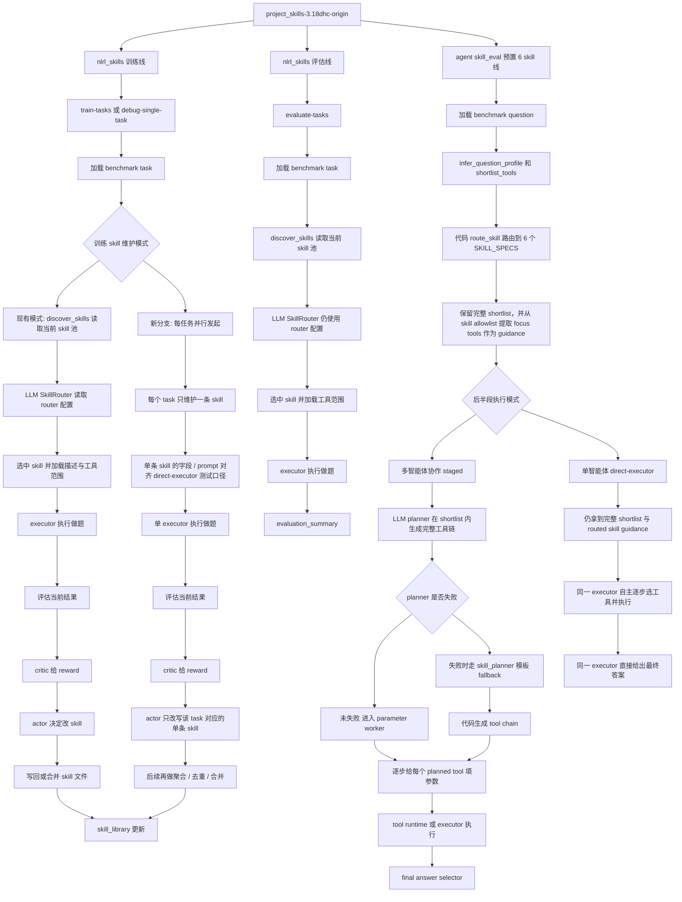

# Origin / DHC / skill-pool 六优良对比分析

> 整理版说明
>
> 这份文件是把原先落在 `docs/analysis/origin_dhc_skillpool_liuyouliang_analysis.md` 的内容同步搬入
> `实验设计与迭代（26.4.8AI尝试整理）`
> 目录后的整理版主落点。
>
> 之后如果还要在“实验整理目录”里继续维护这类三对象对比与六优良分析，应优先改这里。

时间：2026-04-01 18:34:42 +0800

这是一份整理后的分析备忘，用来区分三个相关对象，并解释最近一轮“六优良”实验的主要结论。

本文专门把下面三个对象分开：

- `origin`：`/data/xsy/project_skills-3.18dhc-origin`
- `当前 DHC`：`/data/xsy/project_skills-3.18dhc`
- `当前 skill-pool`：`/data/xsy/skill-pool`

说明：

- 本文主要记录本地工作区中的实现差异与实验结论，不属于运行时必读文档。
- 文中的绝对路径均指向当前机器上的对应仓库。
- 下文统一把三者分开描述，避免混淆。

---

## 1. origin 的“三模式”到底是什么

如果说的是 `origin` 项目根目录下 `nlrl_skills.cli` 的核心运行模式，那么它的三个核心运行模式是：

1. `debug-single-task`
2. `train-tasks`
3. `evaluate-tasks`

对应代码在：

- `/data/xsy/project_skills-3.18dhc-origin/nlrl_skills/cli.py`

具体区别：

### 1.1 `debug-single-task`

- 作用：对单个 task 跑一轮完整闭环，主要用于调试和观察。
- 本质：单题训练模式。
- 会跑完整的 `router -> executor/env -> critic -> actor` 闭环。
- 会改 skill 库，会写 experience buffer。
- 适合看单题为什么失败、actor 到底怎么改 skill。

### 1.2 `train-tasks`

- 作用：连续对多个 task 跑训练。
- 本质：批量训练模式。
- 也会经过 `router -> executor/env -> critic -> actor`。
- 会持续更新 `skill_library/` 和 `experience_buffer.jsonl`。
- 用来“长技能库”。

### 1.3 `evaluate-tasks`

- 作用：拿当前 skill 库做纯评估。
- 本质：固定 skill 库的测试模式。
- 不再跑 critic/actor 改 skill。
- 只看当前 skill 库在 benchmark 上的表现。

### 1.4 需要注意的一个混淆点

`origin` 里其实还有另一套“阶段划分”，那是 `agent/skill_eval` 里的三阶段：

1. planning only
2. parameter generation + tool execution
3. final answer selection

这个三阶段是在：

- `/data/xsy/project_skills-3.18dhc-origin/agent/skill_eval/README.md`
- `/data/xsy/project_skills-3.18dhc-origin/agent/skill_eval/staged_runner.py`

所以这里其实有两个“三分法”：

- `nlrl_skills` 的三个运行模式：`debug-single-task / train-tasks / evaluate-tasks`
- `agent/skill_eval` 的三个执行阶段：`plan / parameter+execute / answer`

---

## 2. origin 到底有没有“自己带着 6 个 skill”

### 2.1 要先分清楚：origin 里其实并存两套 skill 体系

#### A. `nlrl_skills` 这套外部 skill 库

这套是项目 README 里写的当前训练出来的 skill 包，存在：

- `/data/xsy/project_skills-3.18dhc-origin/skill_library/`

README 里列的是 4 个 skill：

- `ndvi-lst-tvdi-annual-trend`
- `ndvi-lst-tvdi-spike-count`
- `ndvi-lst-tvdi-single-date-threshold-exceedance`
- `ndvi-lst-tvdi-multidate-area-exceedance-count`

也就是说：

- `origin` 的外部 skill 库是当时训练出来的 4 个 TVDI 方向 skill

#### B. `agent/skill_eval` 这套代码级 6-skill family

这套在：

- `/data/xsy/project_skills-3.18dhc-origin/agent/skill_eval/skill_router.py`

这里内建了 6 个 `SkillSpec`：

- `earth-spectrum-thermal-retrieval`
- `earth-spectrum-drought-stress`
- `earth-product-timeseries`
- `earth-product-derived-index-change`
- `earth-product-raster-arithmetic`
- `earth-rgb-perception-change`

所以结论是：

- **origin 项目整体带的是 4 个外部 TVDI skill**
- **`agent/skill_eval` 这条评估子系统内部，确实自带 6 个代码级 skill family**

这两套需要分开看。

### 2.2 origin 的评估测试里，skill 是怎么选的

如果说的是 `origin/agent/skill_eval` 这条评估链，那么：

- 选 skill 由 `route_skill()` 里的代码路由完成

代码在：

- `/data/xsy/project_skills-3.18dhc-origin/agent/skill_eval/skill_router.py`

它的逻辑是：

1. 先看题目关键词和文件特征做语义规则分流
2. 如果前面规则没命中，再用题号区间兜底

也就是说：

- **路由逻辑由代码规则驱动**
- **模型不会在 6 个 skill 里自由挑选**
- **代码会先决定 skill bucket**

而且这个路由已经精确到关键词层面，比如：

- `tvdi / drought / dryness / ATI` -> `earth-spectrum-drought-stress`
- `split-window / single-channel / band 31 / band 32 / lst` -> `earth-spectrum-thermal-retrieval`
- `png/jpg/building/airport/centroid/distance/destroyed` -> `earth-rgb-perception-change`

如果关键词没命中：

- `qid <= 100` -> thermal
- `qid <= 188` -> product-timeseries
- 否则 -> rgb

所以 skill 分配本身在这条链上是很强的代码先验。

### 2.3 origin 对工具链顺序是怎么做的

这个地方要特别区分：

#### 先说 `origin` 本身

`origin` 里虽然已经有：

- `/data/xsy/project_skills-3.18dhc-origin/agent/skill_eval/skill_planner.py`

这个模板文件，

**在 origin 本身，这个模板文件只承担 fallback 角色。**

origin 的 README 和 `skill_llm_planner.py` 写得很清楚：

- 主路径：`skill-llm-json`
- 次路径：`skill-llm-tagged-fallback`
- 模板：`skill-template-fallback`

也就是：

- origin 默认仍然是 `LLM planner` 产出完整 `tool_sequence`
- `skill_planner.py` 只是 fallback
- 不会像当前 DHC 那样默认强制模板

所以对于 `origin` 来说：

- 有模板文件
- 默认流程仍由 `LLM planner` 生成工具链

#### 再说模板文件到底细到什么程度

`skill_planner.py` 用的是 family 级规则模板，不按题号查 gold trajectory。

它的粒度是：

- 先按 `skill_id` 分到一个模板函数
- 再在模板函数里根据题面关键词、年份、compare/trend 等模式拼出顺序

例如 drought 模板里大致是：

- 先 `get_filelist`
- 如果题面是 ATI 就用 `ATI`，否则用 `compute_tvdi`
- 如果是 `trend/annual`，后面接重复的 `calculate_tif_average`，再 `calc_batch_image_mean`，再 `compute_linear_trend`
- 如果是 `threshold/severity`，后面接 `calculate_threshold_ratio`
- 如果是 `difference/compare`，就做两段再接 `difference`

所以它是：

- **family 级别的规则模板**
- **不会走每题一份 gold 查表**

### 2.4 那么 origin 里的“6 个 skill”有没有用

对 **origin 本身** 来说，6 个 skill 仍然有用。

因为 origin 默认路径里，6 个 skill 仍然负责：

1. 代码路由
2. 工具 allowlist / shortlist 范围
3. planner prompt 里的 skill-specific guidance
4. 后续参数和执行阶段的上下文约束

所以对 origin 来说更准确的说法是：

- 6 个 skill 属于 **代码里的 6 个运行时 skill family**

真正让 skill 存在感明显下降的是 **后来的当前 DHC 最新实验**：

- 它把 planner 又进一步强化成了 `skill-template-forced`
- 于是“工具顺序”这一层基本被代码模板接管了

所以请务必区分：

- **origin**：skill 仍然是主路径里的一部分，模板只是 fallback
- **当前 DHC 最新 run**：skill family 仍在，但工具顺序已经基本由代码模板主导

### 2.5 后面流程

你对后半段的理解基本是对的：

- planner 先出工具链
- parameter worker 逐步出参数
- executor 执行工具
- 最后 answer selector 选答案

这一点和你一贯认知是一致的。

---

## 3. 最近一次 DHC vs skill-pool 六优良实验，对比后到底说明什么

这里我对比的是最近一次正式 `6优良` run：

### 3.1 当前 DHC 最新 6优良 run

路径：

- `/data/xsy/project_skills-3.18dhc/runs/skill_eval_full/qwen3_8b_paid_skill_eval_parallel100_url34_sets/20260401_111039/`

总 summary：

- `count = 248`
- `avg_accuracy = 0.3508`
- `avg_efficiency = 0.5936`
- `avg_tool_any_order = 0.5927`
- `avg_tool_in_order = 0.4748`
- `avg_tool_exact_match = 0.4357`
- `avg_parameter_accuracy = 0.001`

并且我统计了全量 `execution_record.json`，结果是：

- `planning_source = skill-template-forced` 的题数：`248 / 248`

也就是说：

- 当前 DHC 这条 run **全部**都是强制模板规划
- 它和 origin 那种“LLM planner 为主，模板 fallback”属于不同形态

### 3.2 当前 skill-pool 最新 6优良 run

路径：

- `/data/xsy/skill-pool/project_skills/runs/evaluate_collaborator6_docref_allqwen/20260401_144845_collaborator6_docref_allqwen3888_global_eval_parallel100_url35_noproxy/`

总 summary：

- `task_count = 248`
- `success_count = 41`
- `Accuracy = 0.1653`
- `TAO = 0.5466`
- `TIO = 0.4564`
- `TEM = 0.3619`
- `Efficiency = 0.5414`
- `Parameters = 0.1758`

此外：

- `no_selected_skill = 4`
- `fallback_count = 3`

### 3.3 先给结论

你怀疑“DHC 那边 skill 选定不难，主要是工具顺序太黄金所以分数异常高”，这个方向 **大体是对的**。更准确的概括是：**优势主要落在工具链黄金，不在参数黄金。**

原因如下。

### 3.4 关键对比结果一：DHC 的优势不在参数层

如果 DHC 真的是靠参数层面“几乎按 gold 调工具”把分数顶上去，那么它的 `parameter_accuracy` 应该很高。

但事实正相反：

- 当前 DHC：`avg_parameter_accuracy = 0.001`
- 当前 skill-pool：`avg_parameter_accuracy = 0.1758`

所以：

- **DHC 的高分主因不在参数精确对齐 gold**
- **参数这层没有表现出更黄金**

### 3.5 关键对比结果二：skill family 的选定有影响，但主分歧点不在这里

我把两边同题的 selected skill 做了对比。

结果：

- 同题选到同一个 skill family：`183 / 248 = 73.79%`

这说明：

- skill family 的差异当然存在
- 整体对齐度已经不低
- 大多数题两边其实已经落到同一个大类里了

所以你说“skill 的选定倒没那么困难”，这个判断是有根据的。

### 3.6 关键对比结果三：真正的大分歧在工具链顺序

我再把两边同题的 **planned tool sequence** 做了逐题对比。

结果：

- 同题工具序列完全一样：`33 / 248 = 13.31%`

也就是说：

- 两边就算很多题进了同一个 skill family
- 但最后真正生成出来的工具链大部分还是不一样

这个差异比 skill family 的分歧大得多。

### 3.7 更关键的一条：当两边工具链一样时，分数差几乎消失

我把 248 题分成两桶：

#### A. 两边计划出的工具链完全一样

- 题数：`33`
- DHC 平均准确率：`0.3333`
- skill-pool 平均准确率：`0.3333`

#### B. 两边计划出的工具链不一样

- 题数：`215`
- DHC 平均准确率：`0.3535`
- skill-pool 平均准确率：`0.1395`

这个结果非常关键。

它几乎可以直接说明：

- **这次两边分数差的主因，确实是工具链规划差异**
- **skill family 选错没有表现成主导项**
- **参数层面也没有出现更黄金的证据**

### 3.8 再看“同 skill”的桶，结论还是一样

我又把题分成：

#### A. 两边选到同一个 skill family

- 题数：`183`
- DHC 平均准确率：`0.3279`
- skill-pool 平均准确率：`0.1639`
- DHC 平均 `TAO`：`0.6147`
- skill-pool 平均 `TAO`：`0.5856`
- DHC 平均 `TEM`：`0.4516`
- skill-pool 平均 `TEM`：`0.4000`
- DHC 平均 `parameter_accuracy`：`0.0014`
- skill-pool 平均 `parameter_accuracy`：`0.1949`

也就是说，即使在“skill 已经选对同一类”的题上：

- DHC 仍然明显更高分
- 但它的参数准确率反而更低

所以差异还是主要来自：

- **DHC 的模板工具链更贴 benchmark canonical trajectory**

### 3.9 关于 skill-pool 这边“注入不合理”的问题

这个问题确实存在，而且会进一步拉低 `skill-pool`。

现在这套 docref 外部 skill 在 `skill-pool` 里有一个明显问题：

- `allowed-tools: Read, Glob, Grep, Bash(python *), Edit`

被 `skills.py` 直接按空格拆成：

- `Read,`
- `Glob,`
- `Grep,`
- `Bash(python`
- `*),`
- `Edit`

这些都偏离了实际 EO 工具名。

所以 `skill-pool` 在 planner 里很容易退回默认工具集，难以拿到真正合理的 skill-specific tool scope。

这会进一步扩大两边工具链不对齐的问题。

但即便把这个 bug 暂时放一边，上面的统计也已经说明：

- **当前 DHC 最新 run 的高分核心仍然是 template-forced 工具链**

### 3.10 这一段最重要的最终判断

我会把结论压成下面三句：

1. **origin 本身属于另一种形态**；origin 默认仍是 LLM planner 主路径，模板只做 fallback。
2. **当前 DHC 最新 6优良 run 的高分，来自 code template 强约束下更贴 benchmark 的工具链顺序。**
3. **和 skill-pool 的差距，主因更偏向“工具链规划方式不同”；skill family 选择并没有显示成主导问题。**

---

## 4. 直接结论

### 4.1 origin 的核心运行模式

origin 的三个核心运行模式是：

- `debug-single-task`
- `train-tasks`
- `evaluate-tasks`

如果说的是 `agent/skill_eval` 内部，它又有 `plan / parameter+execute / answer` 三阶段。

### 4.2 origin 中的两套 skill 体系

origin 中同时存在两套 skill 体系：

- 外部 `skill_library/` 有 4 个训练出来的 skill
- `agent/skill_eval` 内部有 6 个代码级 skill family

并且在 origin 的 `agent/skill_eval` 里：

- skill 选择是代码路由，关键词优先，题号区间兜底
- 但工具链顺序默认还是 LLM planner 生成
- `skill_planner.py` 模板在 origin 里只是 fallback，主路径仍由 planner 负责

所以对 origin 来说，6 个 skill 仍然有实际作用。

### 4.3 最近一次对比的主要结论

最近一次对比说明：

- 当前 DHC 的参数并不比 skill-pool 更黄金
- 但它的工具链顺序明显更贴 benchmark
- 两边同题同 skill 的比例有 `73.8%`
- 两边同题同工具链的比例只有 `13.3%`
- 当工具链一样时，两边准确率几乎一样
- 当工具链不一样时，DHC 明显更高

所以你那句“主要是工具那边给定得太黄金了导致分数异常高”，可以压成更准确的一句：

> 当前 DHC 最新 run 的优势主要来自 code template 强约束下的 benchmark-faithful 工具链；主导因素集中在工具链，skill 选择和参数层面的黄金对齐都排在后面。

---

## 5. origin 三条主线架构图

下面这张图只针对 `project_skills-3.18dhc-origin`，把你容易混的三条线放在一张图里：

- `nlrl_skills` 训练
- `nlrl_skills` 用 skill 池评估 `agent/skill_eval` 用预置 6 skill family 评估

### 5.1 看图时只记这几条

- `nlrl_skills` 的 `router` 是真的 `LLM router`，而且训练和评估都用它。
- `nlrl_skills` 的 skill 来源是外部 `skill_library/*/SKILL.md`，也就是一个可被 actor/critic 持续改写的 skill 池。
- `agent/skill_eval` 这条线没有用 `configs/system.json` 里的 `router`；它的 skill 分配是 `skill_router.py` 里的 `route_skill()` 代码路由。
- `agent/skill_eval` 的 6 个 skill family 直接来自内嵌在 `.py` 里的 `SKILL_SPECS`。
- `origin` 的 `agent/skill_eval` 默认仍是 `LLM planner` 产出 `tool_sequence`，`skill_planner.py` 在 origin 里只是 fallback，不承担主路径强制模板角色。

### 5.2 一句话对照

- `nlrl_skills`：动态 skill 池系统，`LLM router` 先选 skill，再让 executor 在该 skill 约束下做题。
- `agent/skill_eval`：固定 6-skill 专用评测链，先 `code route skill`，再让 planner 在收紧后的工具空间里生成工具链。

---

## 6. `project_skills-3.18dhc-19.40` 近期相关改动

这里单独落一下最近这轮在 `project_skills-3.18dhc-19.40` 上产生的实际改动，以及和后续训练方案相关、但目前主要还停留在架构口径层面的新分支。

### 6.1 已经落到代码里的改动

当前 `linux` 分支最近几次提交主线是：

- `7e05feb fix: run linux smoke eval without proxy`
- `ee3e124 fix: stabilize linux D0 eval runtime`
- `d831205 feat: add direct executor mode for skill eval`

其中最重要的是 `agent/skill_eval` 这条 `D0` 线新增了一个 `direct-executor` 模式。

它的关键点落在后半段执行形态调整：

- 仍然先做 `infer_question_profile + shortlist_tools`
- 仍然先做 `route_skill` 路由到内置 `6 skill family`
- 仍然保留完整 `shortlist`
- `skill allowlist` 仍然主要作为 `focus tools / guidance`
- 真正变化的是：后半段不再强制走 `planner -> parameter worker -> executor -> answer selector`
- 新模式下改为单个 `direct-executor` 在同一份 `shortlist + routed skill guidance` 上逐步决定下一步工具

也就是说，新增的是：

- `staged` 多智能体协作后半段
- `direct-executor` 单智能体逐步选工具后半段

这次改动不包含：

- 重新发明一套新的 6-skill 路由逻辑
- 用代码直接替模型指定最终工具链

这次在 Linux 上为了让 `D0` 能稳定跑起来，还顺手补了几类稳定性改动：

- 默认不走系统代理，改为显式直连调用
- 增加了 LLM 并发闸门，避免高并发时把接口打崩
- `ToolRuntime` 加了导入锁，避免多线程导入工具模块时互相污染 `sys.argv`
- 网络重试和等待策略做了兼容性增强

### 6.2 6-skill 测试这边目前结论

基于最近一次 `direct-executor` 全量跑完后的结果，当前它比原来的拆分式后半段更值得保留为默认方案。

这次 `direct-executor` 最终汇总大致是：

- `count = 248`
- `avg_accuracy = 0.4476`
- `avg_efficiency = 2.1288`
- `avg_tool_any_order = 0.7145`
- `avg_tool_in_order = 0.6555`
- `avg_tool_exact_match = 0.4125`
- `avg_parameter_accuracy = 0.2338`

对照之前拆分式后半段基线：

- `avg_accuracy = 0.3508`
- `avg_efficiency = 0.5936`
- `avg_tool_any_order = 0.5927`
- `avg_tool_in_order = 0.4748`
- `avg_tool_exact_match = 0.4357`
- `avg_parameter_accuracy = 0.001`

所以当前判断可以简化成一句：

> 如果目标是现阶段 benchmark 实分与整体执行效果，`direct-executor` 比拆分式后半段更优；拆分式只在 `tool_exact_match` 上略占优势。

### 6.3 训练侧新增的“并行单条 skill”分支

这部分目前最重要的是先把口径定清楚。

最近讨论后，训练侧在这份图里新增了一条分支：

- 每个 task 并行发起
- 每个 task 只维护一条 skill
- 这条 skill 的字段、提示组织方式、工具使用口径尽量和最终 `direct-executor` 测试模式对齐
- 后面再做聚合、去重、合并

这样做的原因是：

- 如果最后理想测试模式是“单 executor 消费单条 skill”，那训练阶段最好也尽量产出同口径 skill
- 这样后续注入优良 skill 时，不需要再额外做一层大幅格式映射
- 即使单条 skill 的字段设计看起来有点别扭，也比训练时和测试时走两套完全不同范式更稳

但这里要明确：

- 这条“每任务并行、单条 skill、对齐 direct-executor”的训练线，目前已经在这份架构图里明确加出来了
- 它是当前对后续训练实现方向的确认
- 但它还没形成已经提交进 `nlrl_skills` 代码的一整套完整实现

换句话说，当前已经真正落地到代码的是 `D0` 的 `direct-executor` 与 Linux/直连/稳定性修复；训练侧这条新线目前更多是已经确定好的下一步实现口径。
